# Buổi 1 — Trước khi hỏi AI, hãy nói rõ mình thực sự cần gì

**Tên chuyên môn:** Framing as Cognitive Control  
**Chủ đề:** Problem Framing & Goal Structuring for AI-mediated Knowledge Work  
**Dành cho:** người làm giáo dục, kinh doanh, marketing, dịch vụ, vận hành và những người không cần biết lập trình.

---

## 0. Bạn sẽ làm được gì sau buổi này?

Sau buổi học, bạn có thể:

- phân biệt **chủ đề**, **bài toán** và **đầu ra**;
- nhận ra vì sao một prompt rất dài vẫn có thể cho kết quả không dùng được;
- xác định rõ người sử dụng, bối cảnh và phạm vi của yêu cầu;
- chọn đúng việc cần giao cho AI: giải thích, so sánh, chẩn đoán, thiết kế, phản biện hay giảng dạy;
- viết một **Framing Brief** — hay gọi đơn giản là **phiếu giao việc cho AI**;
- tự kiểm tra và sửa 3–5 prompt cũ của chính mình.

Chỉ riêng việc xác định đúng bài toán đã có thể làm chất lượng làm việc với AI tăng rõ rệt, ngay cả khi bạn chưa học kỹ thuật prompt nâng cao.

---

## 1. Tình huống mở đầu: vì sao prompt dài vẫn không hiệu quả?

Hãy đọc hai cách giao việc sau.

### Cách A — dài nhưng mơ hồ

> Hãy đóng vai chuyên gia hàng đầu về chăm sóc khách hàng. Hãy giải thích thật chi tiết, chuyên nghiệp, có ví dụ, quy trình, những sai lầm thường gặp và lộ trình đào tạo nhân viên.

### Cách B — ngắn hơn nhưng rõ việc

> Trong hai tuần tới, tôi cần tổ chức một buổi hướng dẫn 90 phút cho 10 nhân viên bán hàng mới.  
> Hãy tạo outline gồm ba phần, tập trung vào cách chào hỏi, tìm hiểu nhu cầu và xử lý khách đang khó chịu.  
> Không đề cập đến CRM hoặc phần mềm.  
> Cuối cùng, tạo thêm một checklist để trưởng nhóm quan sát nhân viên thực hành.

Cách A nghe có vẻ “xịn” nhưng AI phải tự đoán rất nhiều. Cách B giúp AI biết:

- làm việc gì;
- cho ai;
- trong hoàn cảnh nào;
- làm đến đâu;
- cần giao lại thứ gì.

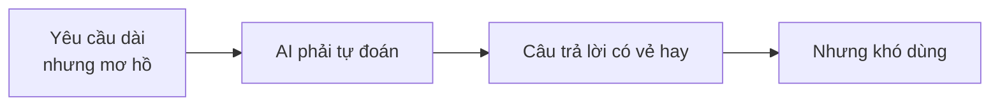

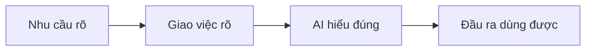

Đây là vấn đề về **framing**, không nhất thiết là do AI “dốt hoặc kém” hoặc do prompt chưa đủ dài.

> **Framing là xác định đúng việc cần giải quyết trước khi yêu cầu AI thực hiện.**

---

## 2. Framing giống việc gì trong đời thường?

Hãy tưởng tượng bạn bước vào quán và nói:

> “Làm cho tôi món gì ngon đi.”

Người phục vụ chưa biết:

- bạn ăn sáng hay ăn tối;
- ăn một mình hay cho cả gia đình;
- có dị ứng món gì không;
- ngân sách bao nhiêu;
- muốn ăn tại chỗ hay mang về.

AI cũng vậy. AI có thể biết rất nhiều món, nhưng không thể tự biết chính xác món nào phù hợp với bạn.

Một ví dụ khác: bạn giao việc cho một nhân viên mới:

> “Em làm giúp anh/chị kế hoạch marketing nhé.”

Nhân viên sẽ phải đoán: kế hoạch cho sản phẩm nào, trong bao lâu, ngân sách bao nhiêu, trình bày cho ai và cần ở dạng slide hay bảng hành động.

Framing chính là **làm rõ những điều đang nằm trong đầu bạn**, để người khác hoặc AI có thể hiểu và xử lý.

---

## 3. Framing nằm ở đâu trong toàn bộ quá trình SID?

Khung 7 bước SID:

> **Frame → Architect → Explore → Reason → Validate → Synthesize → Transfer**

Buổi 1 tập trung vào bước đầu tiên: **Frame**.

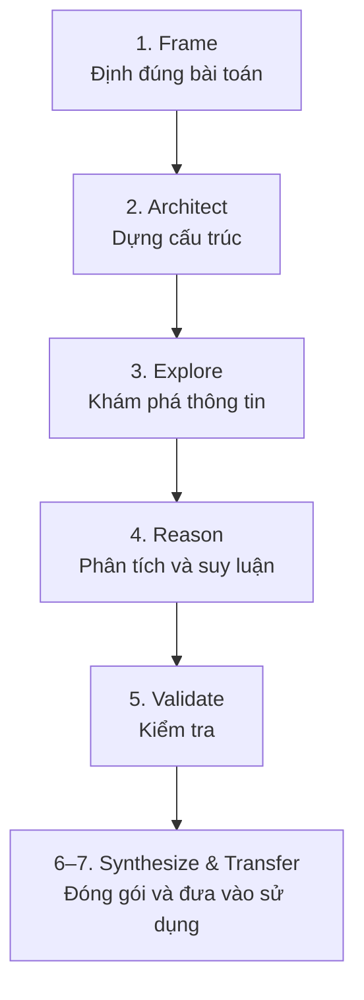

Nếu Frame sai:

- **Architect** sẽ bóc tách sai cấu trúc;
- **Explore** sẽ tìm quá rộng hoặc quá hẹp;
- **Reason** sẽ phân tích sâu nhầm chỗ;
- **Validate** sẽ kiểm tra theo nhầm tiêu chí;
- **Synthesize và Transfer** sẽ tạo ra sản phẩm trông hoàn chỉnh nhưng không dùng được.

Từ Buổi 2 trở đi, bạn sẽ luôn xuất phát từ Framing Brief được tạo trong buổi này.

---

## 4. Khung 6 câu hỏi trước khi giao việc cho AI

Tên kỹ thuật của khung này là **5W-O**:

> What – Why – Who – Where – Width/Depth – Output

Bạn không nhất thiết phải nhớ các từ tiếng Anh. Chỉ cần nhớ sáu câu hỏi:

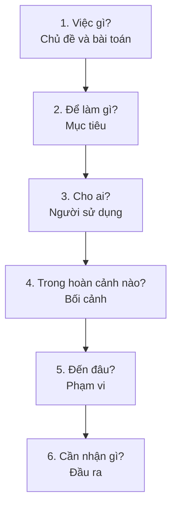

| Câu hỏi đời thường | Tên chuyên môn | Ý nghĩa |
|---|---|---|
| Đang nói về việc gì? | Topic + Problem Framing | Chủ đề là gì và cần làm gì với chủ đề đó? |
| Hỏi để làm gì? | Goal Framing | Kết quả sẽ giúp bạn hiểu, quyết định hay triển khai việc gì? |
| Làm cho ai dùng? | Audience Framing | Người dùng đầu ra có nền tảng và nhu cầu thế nào? |
| Trong hoàn cảnh nào? | Context | Ngành, quy mô, thời gian, ngân sách và ràng buộc thực tế |
| Làm đến đâu? | Scope Design | Phần nào cần làm, phần nào chưa làm, sâu đến mức nào? |
| Cần giao lại thứ gì? | Output Framing | Bảng, checklist, quy trình, giáo án, kịch bản hay sản phẩm nào khác? |

Một Framing Brief tốt ít nhất phải trả lời đủ sáu câu hỏi này.

---

## 5. Kỹ thuật 1 — Phân biệt Topic và Problem

### 5.1. Cốt lõi

- **Topic** là “đang nói về cái gì”.
- **Problem** là “đang cần làm gì với cái đó”.

Ví dụ:

- Topic: **đi du lịch Đà Nẵng**.
- Problem có thể là:
  - chọn thời điểm đi;
  - lập ngân sách;
  - thiết kế lịch trình cho gia đình có trẻ nhỏ;
  - so sánh ba khách sạn;
  - chuẩn bị danh sách đồ cần mang.

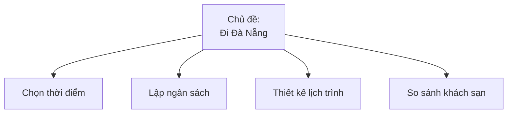

Cùng một chủ đề nhưng mỗi bài toán cần dữ liệu, cách suy nghĩ và đầu ra khác nhau.

### 5.2. Ví dụ trong công việc

Prompt chưa rõ:

> Hãy giải thích thật chi tiết về marketing online, các kênh phổ biến, chiến lược hiệu quả, sai lầm thường gặp và cho tôi lộ trình học trong sáu tháng.

Topic “marketing online” đã rõ, nhưng bài toán vẫn mờ:

- Bạn muốn tự chạy marketing cho cửa hàng?
- Bạn muốn biết đủ để thuê agency?
- Bạn muốn đào tạo nhân viên?
- Hay bạn cần chọn một kênh để đầu tư?

Ví dụ rõ hơn:

> Tôi muốn hiểu marketing online đủ để tự thiết kế một chiến dịch ba tháng cho cửa hàng đồ uống nhỏ, với ngân sách quảng cáo 15 triệu đồng mỗi tháng.

Hoặc:

> Tôi muốn hiểu marketing online để dạy lại cho đội sale, tập trung vào cách tận dụng nội dung và mạng xã hội, không đi sâu vào kỹ thuật chạy quảng cáo.

### 5.3. Câu hỏi tự kiểm

Tôi đang muốn:

- hiểu một khái niệm;
- so sánh các phương án;
- chẩn đoán một vấn đề;
- thiết kế một thứ mới;
- đánh giá hoặc kiểm tra một thứ đang có;
- hay dạy lại cho người khác?

### 5.4. Prompt để AI giúp bạn tìm đúng bài toán

```text
Tôi đang quan tâm đến chủ đề: [CHỦ ĐỀ].

Hãy giúp tôi tìm bài toán thực sự cần giải quyết.

1. Liệt kê 4–6 bài toán khác nhau có thể nằm dưới chủ đề này.
2. Với mỗi bài toán, cho biết:
   - mục tiêu thực sự;
   - loại đầu ra phù hợp;
   - rủi ro nếu chọn nhầm bài toán.
3. Dựa trên bối cảnh của tôi: [MÔ TẢ NGẮN],
   hãy đề xuất một problem statement phù hợp nhất.

Trình bày:
- một bảng các bài toán có thể có;
- một câu problem statement được đề xuất.
```

---

## 6. Kỹ thuật 2 — Xác định Goal và Output

### 6.1. Goal: hỏi để làm gì?

Goal là điều bạn muốn đạt được sau khi nhận câu trả lời.

Ví dụ, cùng hỏi về “ăn uống lành mạnh”:

- để hiểu kiến thức cơ bản;
- để chọn món khi đi ăn ngoài;
- để lên thực đơn bảy ngày;
- để chuẩn bị danh sách mua hàng;
- để trao đổi tốt hơn với chuyên gia dinh dưỡng.

### 6.2. Output: muốn AI giao lại “món đồ” gì?

Output không phải là:

- thật chi tiết;
- thật chuyên nghiệp;
- thật sâu sắc;
- đầy đủ từ A đến Z.

Đó chỉ là tính từ. Output phải là một sản phẩm có thể gọi tên và sử dụng.

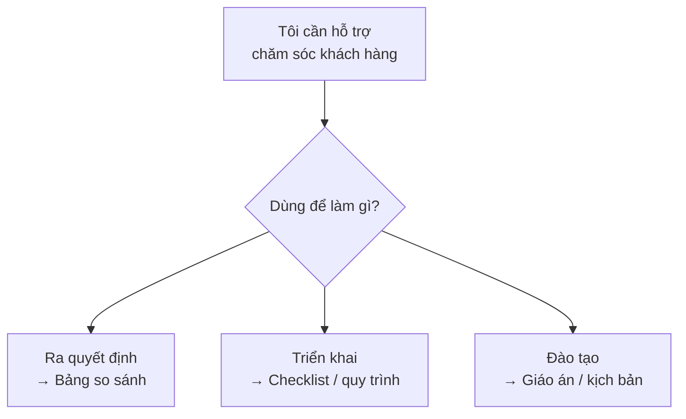

Các dạng đầu ra thường gặp:

| Tên dễ hiểu | Tên thường gặp | Khi nào nên dùng? |
|---|---|---|
| Bản ghi chú khái niệm | Concept note | Cần hiểu nhanh một vấn đề |
| Bảng so sánh | Comparison table | Cần chọn giữa nhiều phương án |
| Khung 5–7 bước | Framework | Cần nhìn toàn bộ logic |
| Bảng kiểm | Checklist | Cần làm hoặc kiểm tra từng việc |
| Cây quyết định | Decision tree | Mỗi điều kiện dẫn đến một lựa chọn |
| Quy trình làm việc | Workflow | Nhiều bước và người tham gia |
| Đề cương khóa học | Syllabus | Cần thiết kế nội dung đào tạo |
| Bảng tiêu chí đánh giá | Rubric | Cần chấm hoặc kiểm tra chất lượng |
| Cẩm nang triển khai | Playbook | Cần hướng dẫn đội nhóm thực hiện |
| Kịch bản | Script | Cần lời thoại hoặc diễn biến cụ thể |

### 6.3. Ví dụ sai → sửa

Prompt chưa rõ:

> Hãy phân tích chi tiết về chăm sóc khách hàng, đưa ra quy trình, kịch bản, sai lầm thường gặp và lộ trình đào tạo nhân viên trong một tháng.

Prompt này trộn nhiều nhiệm vụ và chưa chọn đầu ra chính.

Phiên bản rõ hơn:

> Trong hai tuần tới, tôi phải tổ chức một buổi đào tạo nội bộ hai tiếng cho 10 nhân viên CSKH của một công ty dịch vụ nhỏ.  
> Hãy đề xuất ba dạng đầu ra phù hợp, phân tích ưu nhược điểm của từng dạng, sau đó chọn một dạng tối ưu.  
> Cuối cùng, tạo outline buổi training hai tiếng gồm mục tiêu học, các phần chính và thời lượng dự kiến.  
> Chỉ tập trung vào kỹ năng phục vụ khách hàng, không đề cập đến hệ thống công nghệ.

### 6.4. Câu hỏi tự kiểm

> Nếu AI làm xong, tôi muốn tải xuống, in ra, gửi cho đồng nghiệp hoặc sử dụng **thứ gì**?

Nếu chưa gọi tên được thứ đó, Goal/Output Framing chưa hoàn thành.

---

## 7. Kỹ thuật 3 — Audience Framing

### 7.1. Cốt lõi

Nội dung đúng chưa đủ; nó phải đúng với **người sẽ sử dụng**.

Một bác sĩ không giải thích bệnh cho bệnh nhân giống cách họ trao đổi với một bác sĩ khác. AI cũng cần biết mình đang viết cho ai.

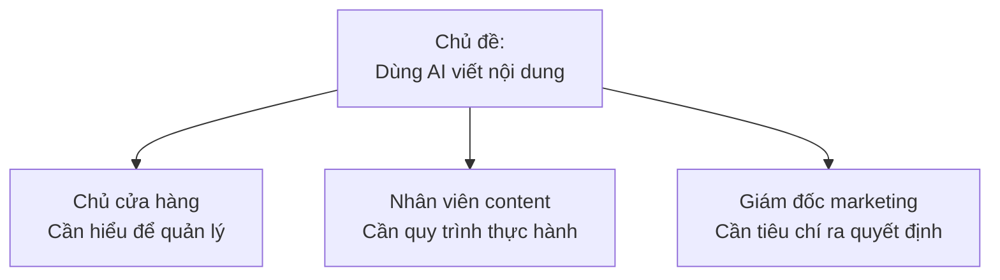

Hãy mô tả:

- nền tảng nghề nghiệp hoặc kiến thức;
- kinh nghiệm với chủ đề hoặc với AI;
- mục tiêu sau khi đọc;
- thời gian, ngôn ngữ và nguồn lực;
- những điều người đó thường thấy khó.

### 7.2. Ví dụ

Prompt chung chung:

> Hãy giải thích cách xây dựng chương trình đào tạo nội bộ thật chi tiết.

Prompt có Audience Framing:

> Hãy giải thích cách xây dựng chương trình đào tạo nội bộ cho trưởng nhóm vận hành của một doanh nghiệp dịch vụ nhỏ.  
> Họ đã từng tổ chức vài buổi training nhưng chưa học về thiết kế khóa học, có ít thời gian và cần công cụ đơn giản.  
> Hãy dùng ví dụ về đào tạo nhân viên tuyến đầu như CSKH và bán hàng; tránh thuật ngữ chuyên môn sâu; tập trung vào 3–5 bước và ba lỗi phổ biến.

---

## 8. Kỹ thuật 4 — Scope Design

### 8.1. Cốt lõi

> **Scope tốt không phải là đưa thật nhiều thứ vào. Scope tốt là biết lúc này chưa cần làm gì.**

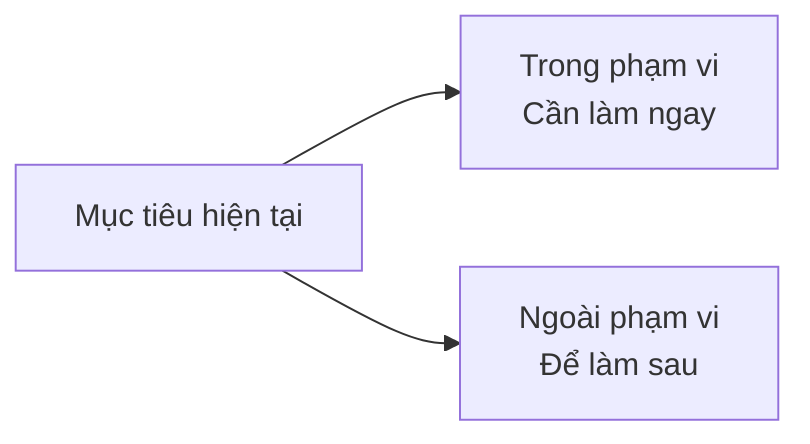

Ví dụ chưa rõ:

> Hãy dạy tôi marketing từ A đến Z, từ cơ bản đến nâng cao, cả chiến lược lẫn chi tiết từng kênh.

Ví dụ rõ hơn:

> Tôi không cần học toàn bộ marketing. Hiện tại tôi cần hiểu đủ để chọn 1–2 kênh, thiết kế chiến dịch ba tháng cho cửa hàng thời trang nhỏ và hướng dẫn lại cho hai nhân viên bán hàng.

| Trong phạm vi | Ngoài phạm vi |
|---|---|
| Khái niệm funnel cơ bản | Chiến lược thương hiệu dài hạn |
| Cách chọn Facebook hoặc TikTok | Tối ưu quảng cáo nâng cao |
| Kế hoạch hành động ba tháng | Nghiên cứu thị trường chuyên sâu |
| Đo lường bằng chỉ số đơn giản | Xây dựng hệ thống dữ liệu phức tạp |

Từ scope trên, có thể yêu cầu AI tạo outline ba buổi, mỗi buổi 90 phút.

---

## 9. Kỹ thuật 5 — Task Definition

### 9.1. AI đang được giao nhiệm vụ gì?

| Khi bạn cần… | Task | AI cần làm gì? |
|---|---|---|
| Hiểu vấn đề | Explain | Giải thích, định nghĩa, mô tả |
| Chọn phương án | Compare | So sánh A/B/C theo tiêu chí |
| Tìm nguyên nhân | Diagnose | Tìm lỗi và nguyên nhân gốc |
| Tạo thứ mới | Design | Thiết kế quy trình, khóa học, chiến dịch |
| Tìm điểm yếu | Critique | Phản biện, chỉ ra rủi ro |
| Dạy người khác | Teach | Soạn giáo án, ví dụ và bài tập |

Sai lầm phổ biến là nhét 4–5 task vào một prompt mà không tách giai đoạn.

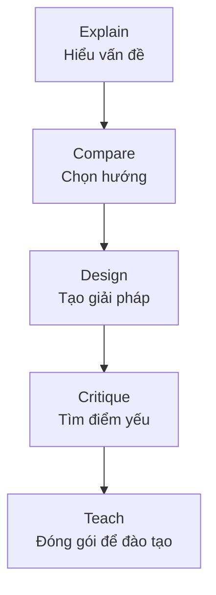

### 9.2. Ví dụ tách task thành các phase

**Phase 1 — Explain**

```text
Tôi đang xây chương trình CSKH cho công ty dịch vụ nhỏ có 10 nhân viên.

Hãy giải thích ở mức dễ hiểu:
1. Chăm sóc khách hàng tốt là gì?
2. Có 5–7 tiêu chí quan trọng nào để đánh giá?

Trả lời ngắn gọn và có ví dụ đời thường.
```

**Phase 2 — Compare**

```text
Dựa trên các tiêu chí trên, hãy so sánh:
1. Chăm sóc chủ động;
2. Chăm sóc phản ứng;
3. Chăm sóc theo vòng đời khách hàng.

Trình bày bằng bảng gồm ưu điểm, nhược điểm và loại doanh nghiệp phù hợp.
```

**Phase 3 — Design**

```text
Hãy thiết kế quy trình CSKH 5–7 bước cho công ty của tôi:
- 10 nhân viên;
- hỗ trợ qua điện thoại và Zalo;
- khách hàng là cá nhân.

Mỗi bước ghi rõ mục tiêu, người phụ trách, đầu vào và đầu ra.
```

**Phase 4 — Critique**

```text
Hãy phản biện quy trình dưới đây: [DÁN QUY TRÌNH].

1. Chỉ ra ít nhất năm điểm yếu hoặc rủi ro.
2. Đề xuất cách sửa cụ thể cho từng điểm.
```

**Phase 5 — Teach**

```text
Hãy biến quy trình đã chỉnh sửa thành tài liệu đào tạo nhân viên mới.

1. Viết bản tóm tắt dễ hiểu, không dùng thuật ngữ khó.
2. Tạo cấu trúc buổi training hai giờ gồm:
   - mục tiêu;
   - nội dung;
   - hoạt động thực hành;
   - cách kiểm tra nhanh cuối buổi.
```

---

## 10. Framing Brief — Phiếu giao việc cho AI

### 10.1. Framing Brief là gì?

Framing Brief là bản mô tả khoảng 150–250 từ, giúp bạn và AI cùng hiểu:

- topic — chủ đề;
- problem — bài toán;
- audience — người sử dụng;
- context — bối cảnh;
- scope — phạm vi;
- draft output — đầu ra dự kiến;
- main task type — nhiệm vụ chính;
- rủi ro nếu định khung sai.

Framing Brief **không chỉ là một prompt**. Nó còn có thể dùng để:

- giúp chính bạn suy nghĩ rõ;
- giao việc cho AI;
- thống nhất với đồng nghiệp hoặc mentor;
- làm đầu vào cho decomposition, information architecture, reasoning và các buổi SID tiếp theo.

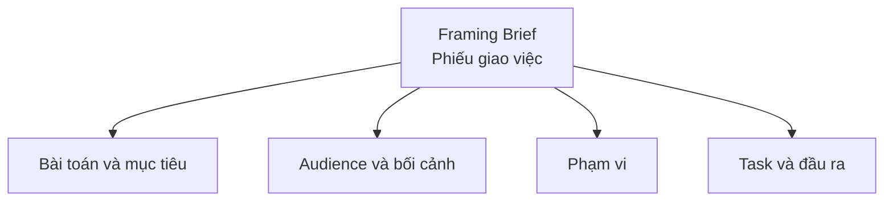

### 10.2. Template đầy đủ

```text
[1] Chủ đề
Tôi đang làm việc với chủ đề: [...]

[2] Bài toán
Bài toán thực sự tôi cần giải quyết là: [...]
Mục đích cuối cùng: [...]

[3] Audience
Đầu ra sẽ được dùng cho: [...]
- Nền tảng/kinh nghiệm: [...]
- Mục tiêu sử dụng: [...]
- Khó khăn hoặc ràng buộc: [...]

[4] Bối cảnh
Thời gian, quy mô, nguồn lực, ngân sách hoặc hoàn cảnh áp dụng: [...]

[5] Scope
- Trong phạm vi: [...]
- Ngoài phạm vi: [...] vì [...]

[6] Output và Task Type
Nhiệm vụ chính của AI: [EXPLAIN / COMPARE / DIAGNOSE / DESIGN / CRITIQUE / TEACH]
Đầu ra ưu tiên: [...]

[7] Rủi ro nếu framing sai
Nếu định khung sai, rủi ro là: [...]
```

### 10.3. Phiên bản siêu ngắn cho người mới

```text
Tôi đang cần: [VIỆC CẦN GIẢI QUYẾT].

Kết quả này dùng cho: [AI SỬ DỤNG].

Bối cảnh của tôi: [THỜI GIAN, NGUỒN LỰC, KINH NGHIỆM, KHÓ KHĂN].

Chỉ tập trung vào: [PHẠM VI CẦN LÀM].
Chưa cần đề cập: [PHẠM VI KHÔNG LÀM].

Tôi muốn AI giúp: [GIẢI THÍCH / SO SÁNH / THIẾT KẾ / PHẢN BIỆN...].

Kết quả cần ở dạng: [BẢNG / CHECKLIST / KẾ HOẠCH / KỊCH BẢN...].
```

---

## 11. Thực hành 1 — Chẩn đoán prompt cũ

### Mục tiêu

Nhìn ra lỗi ở gốc trong cách mình giao việc cho AI.

### Bước 1: lấy dữ liệu thật

Mở lịch sử ChatGPT, Claude, Gemini hoặc công cụ bạn thường dùng. Chọn 3–5 prompt mà bạn từng kỳ vọng cao nhưng kết quả nhận về khó sử dụng.

### Bước 2: tự chấm

| Yếu tố | Trạng thái | Ghi chú lỗi |
|---|---|---|
| Topic | Có / Không | |
| Problem | Rõ / Mơ hồ / Trộn nhiều bài toán | |
| Audience | Rõ / Mơ hồ / Không có | |
| Context | Rõ / Thiếu | |
| Scope | Rõ / Quá rộng / Quá hẹp / Không có | |
| Output | Sản phẩm rõ / Chỉ yêu cầu “chi tiết” | |
| Task | Một nhiệm vụ / Nhiều nhiệm vụ trộn | |

### Bước 3: viết lại

Đừng cố làm prompt “hay” ngay. Trước hết, viết 1–3 câu Framing Brief rút gọn.

Ví dụ:

> Tôi là quản lý nhân sự của doanh nghiệp dịch vụ 50 người. Trong một tháng tới, tôi cần thiết kế khóa đào tạo ba buổi, mỗi buổi hai tiếng, cho nhân viên CSKH về giao tiếp và xử lý phàn nàn. Tôi cần outline ba buổi và checklist kỹ năng; không đi sâu vào phần mềm.

---

## 12. Thực hành 2 — Một chủ đề, nhiều bài toán

Chọn một chủ đề thật, ví dụ:

- AI hỗ trợ content marketing;
- AI trợ lý cho giáo viên;
- đào tạo nhân viên bằng AI;
- AI hỗ trợ chăm sóc khách hàng;
- AI hỗ trợ xây dựng quy trình bán hàng.

Liệt kê ít nhất năm bài toán khác nhau.

Ví dụ với “AI hỗ trợ content marketing”:

1. Hiểu AI có thể hỗ trợ những khâu nào.
2. So sánh dùng AI với thuê freelancer.
3. Thiết kế quy trình lên lịch và viết bài trong ba tháng.
4. Thiết kế khóa học hai buổi cho nhân viên content.
5. Thiết kế rubric đánh giá chất lượng nội dung có AI hỗ trợ.

Với mỗi bài toán, gán:

- một output chính;
- một task type chính.

---

## 13. Thực hành 3 — Đổi audience, đổi toàn bộ cách làm

Giữ nguyên topic “Sử dụng AI trong marketing nội dung”, nhưng viết ba framing khác nhau:

- Chủ doanh nghiệp nhỏ, ít dùng công nghệ;
- Nhân viên content đã dùng AI 1–2 năm;
- Giám đốc marketing cần ra quyết định chiến lược.

Với mỗi audience, viết:

- mục tiêu;
- phạm vi;
- đầu ra.

Bạn sẽ thấy cùng một topic nhưng framing và output thay đổi rõ rệt.

---

## 14. Bài tập cuối buổi

Chọn một chủ đề thuộc công việc thật và viết một Framing Brief hoàn chỉnh.

Gợi ý:

- AI trong thiết kế chương trình đào tạo;
- AI hỗ trợ content marketing;
- AI hỗ trợ chăm sóc khách hàng;
- AI trợ lý soạn giáo án;
- AI hỗ trợ xây dựng quy trình bán hàng.

### Cấu trúc bài nộp

```markdown
# Framing Brief — [Tên chủ đề]

## 1. Chủ đề

## 2. Bài toán và mục tiêu

## 3. Audience

## 4. Bối cảnh

## 5. Scope: trong và ngoài phạm vi

## 6. Output và Task Type

## 7. Rủi ro nếu framing sai
```

Độ dài gợi ý: 150–250 từ.

### Rubric tự chấm

| Tiêu chí | Câu hỏi kiểm tra | Điểm |
|---|---|---:|
| Problem clarity | Đã phân biệt topic và problem chưa? | /5 |
| Goal/Output frame | Đầu ra có phải sản phẩm cụ thể và dùng được không? | /5 |
| Audience fit | Audience có nền tảng, mục tiêu và bối cảnh rõ không? | /5 |
| Scope quality | Trong và ngoài phạm vi có rõ không? | /5 |
| Task definition | Có một nhiệm vụ chính hay đang trộn quá nhiều việc? | /5 |
| Clarity & usability | Người khác đọc brief có thể bắt đầu làm ngay không? | /5 |

Nếu tổng điểm dưới 20/30, hãy sửa lại trước khi chuyển sang buổi tiếp theo.

---

## 15. Hiểu sâu hơn: Extended Mind, NLP Mindset và AI Mindset

Phần này giữ lại nền tảng lý thuyết của bài nhưng được đặt ở cuối để người mới không bị ngợp.

### 15.1. Framing là đưa cấu trúc trong đầu ra bên ngoài

Khi suy nghĩ còn nằm trong đầu, nó thường mơ hồ và lẫn lộn. Khi viết ra mục tiêu, audience, bối cảnh, phạm vi, đầu ra và ràng buộc, bạn biến suy nghĩ thành một cấu trúc có thể quan sát, kiểm tra và trao cho AI xử lý.

Ba khái niệm liên quan:

- **Extended Mind:** AI không chỉ trả lời câu hỏi mà có thể trở thành một phần của hệ thống nhận thức mở rộng, hỗ trợ trí nhớ, tổ chức và quy trình suy nghĩ.
- **NLP Mindset:** ngôn ngữ tự nhiên không chỉ là “viết văn”; nó là cách mô tả cấu trúc của vấn đề bằng mục tiêu, người dùng, bối cảnh, đầu ra và giới hạn.
- **AI Mindset:** xem AI như một hệ thống nhiều tầng cần được định hướng, kiểm tra và phản biện, thay vì tin rằng một câu prompt hay sẽ tự giải quyết mọi thứ.

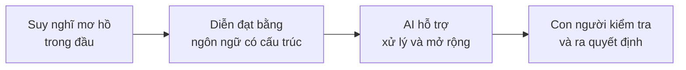

### 15.2. Năm loại tư duy cần có

| Loại tư duy | Cách hiểu đời thường | Câu hỏi tự kiểm |
|---|---|---|
| Strategic Thinking | Nhìn mục tiêu lớn và thứ tự ưu tiên | Việc này tạo ra kết quả gì? Điều gì quan trọng nhất? |
| Systems Thinking | Nhìn các phần liên quan như một hệ thống | Lỗi nằm ở input, dữ liệu, công cụ, quy trình hay cách đánh giá? |
| Structural Thinking | Sắp xếp vấn đề thành các thành phần rõ | Đã rõ mục tiêu, audience, output, scope và ràng buộc chưa? |
| Task Decomposition | Chia việc lớn thành các việc nhỏ | Có thể tách việc này thành những bước độc lập nào? |
| Critical Thinking | Không đồng nhất “nói hay” với “nói đúng” | Giả định, nguồn và kết luận đã được kiểm tra chưa? |

Ví dụ thay vì nói:

> Hãy giúp tôi làm kế hoạch marketing cho quán cà phê.

Có thể đưa cấu trúc trong đầu ra rõ hơn:

> Tôi cần một campaign playbook ba tháng cho quán cà phê nhỏ.  
> Người sử dụng là chủ quán và hai nhân viên.  
> Mục tiêu là tăng lượt khách quay lại 15%.  
> Ngân sách 20 triệu đồng mỗi tháng; kênh chính là Facebook và TikTok.  
> Đầu ra gồm bảng ưu tiên kênh, timeline 12 tuần và checklist triển khai.  
> Không phân tích công nghệ; chỉ tập trung vào nội dung và quảng cáo địa phương.

Nói ngắn gọn:

> Framing không chỉ là viết prompt tốt hơn. Đó là tổ chức tư duy bằng ngôn ngữ, rồi dùng AI như một phần của hệ thống nhận thức mở rộng.

---

## 16. Dùng Framing Brief cho các buổi sau

- **Buổi 2 — Prompt Stack:** dùng brief làm context, gán role và một task chính cho mỗi prompt.
- **Buổi 3–4 — Decomposition & IA:** dùng topic và scope để bóc tách, dựng cấu trúc.
- **Buổi 5 — Expansion:** dùng problem và audience để chọn trọng tâm khi quét rộng hoặc đào sâu.
- **Buổi 6–7 — Reasoning & Validation:** dùng goal, output và task type để chọn cách suy luận và tiêu chí kiểm tra.
- **Buổi 8 — Synthesis & Transfer:** dùng toàn bộ brief để chọn framework và thiết kế tài liệu sát bối cảnh.

---

## 17. Tự kiểm cuối buổi

Bạn có thể trả lời “Có” cho năm câu hỏi sau chưa?

1. Tôi có thể nhìn vào một prompt dài và chỉ ra nó thiếu Problem, Audience, Context, Scope, Output hay Task nào.
2. Tôi có thể viết 3–5 bài toán khác nhau cho cùng một chủ đề.
3. Tôi có thể gọi tên đầu ra cần nhận, thay vì chỉ yêu cầu “trả lời chi tiết”.
4. Tôi đã viết xong Framing Brief cho một tình huống thật.
5. Tôi hiểu rằng đổi framing có thể làm chất lượng làm việc với AI thay đổi rõ rệt, ngay cả khi chưa dùng kỹ thuật nâng cao.

Nếu chưa thoải mái với câu nào:

- quay lại bài tập;
- chọn một prompt cũ;
- dùng khung sáu câu hỏi để “phẫu thuật” prompt đó;
- sửa đến khi người khác đọc vào cũng hiểu bạn thực sự cần gì.

