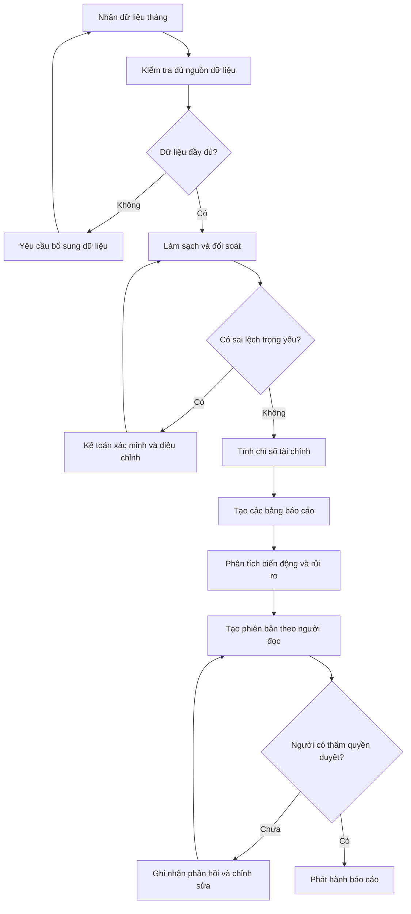
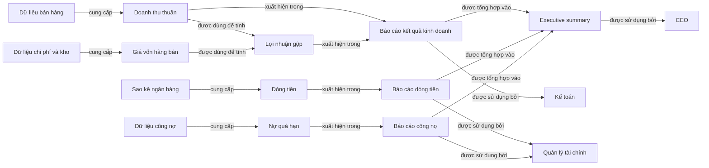

# Buổi 4 — Information Architecture & Representation  
> Biến bản đồ tri thức thành cấu trúc dễ đọc, dễ khai thác, dễ so sánh, dễ dùng

---

## 0. Bạn đã có gì trước Buổi 4?

Từ Buổi 1–3, bạn (lý tưởng) đã có:

1. **Framing Brief** cho 1 domain thật.  
2. **Prompt Stack V1** cho domain đó.  
3. **Decomposition Tree** 3–4 tầng (≥20 node).  
4. **Functional map hoặc Stakeholder map**.

Buổi 4 sẽ dùng các artifact trên để:

- chọn **dạng biểu diễn** (representation) phù hợp,
- dựng **taxonomy**, **hierarchy**, **bảng/matrix**, **flowchart** và **concept map**,
- làm ra 1 **IA Pack** có thể dùng cho:
  - dạy học,  
  - thiết kế assistant/GPT,  
  - trình bày với stakeholder.

---

## 1. Mục tiêu Buổi 4

Sau buổi này, bạn có thể:

1. Phân biệt rõ:
  - **Taxonomy** vs **Hierarchy** vs **Ontology thinking** vs **Table** vs **Matrix** vs **Flowchart** vs **Concept map**.
2. Biết **khi nào dùng dạng nào**, theo mục tiêu:
   - học nhanh,
   - so sánh,
   - ra quyết định,
   - thiết kế khóa học.
3. Chuyển Decomposition Tree thành:
   - **Taxonomy** (phân loại theo tiêu chí),
   - **Hierarchy** (outline tài liệu, báo cáo hoặc khóa học),
   - 1 **bảng** hoặc **matrix so sánh** có ý nghĩa,
   - 1 **flowchart** cho quy trình,
   - 1 **concept map** cho mạng quan hệ.
4. Tạo được **IA Pack** cho domain của bạn:
   - 1 taxonomy,
   - 1 hierarchy,
   - 1 table/matrix,
   - 1 flowchart,
   - 1 concept map.

---

## 2. Vấn đề: cùng 1 nội dung, nhiều cách biểu diễn – không phải cách nào cũng tốt
> Dữ liệu sẽ không có ý nghĩa cho đến khi nó được biểu diễn, sắp xếp để trở thành thông tin hữu ích

### 2.1. Biểu diễn không phải chuyện… trang trí

Cùng 1 tập tri thức, bạn có thể:

- viết thành đoạn văn dài,
- bullet list,
- cây phân cấp,
- bảng so sánh,
- matrix 2 chiều,
- sơ đồ flow,
- concept map.

**Nhưng**:

- dạng trình bày **ảnh hưởng trực tiếp** đến:
  - tốc độ hiểu,
  - khả năng nhớ,
  - khả năng so sánh,
  - khả năng dạy lại.

### 2.2. Vấn đề hay gặp (giống user AI 1–3 năm)

- Dùng **bullet list** cho mọi thứ:
  - dù cần so sánh,
  - dù cần phân loại.
- Dùng **bảng** nhưng:
  - cột đặt tùy hứng,
  - không rõ tiêu chí,
  - người đọc không thấy “ra quyết định gì” từ đó.
- Nhầm lẫn:
  - Taxonomy = Hierarchy,
  - mọi cây phân cấp đều là “outline”.

---

## 3. Bảng khái niệm Buổi 4

| Khái niệm         | Mô tả ngắn                                                                                 |
|-------------------|--------------------------------------------------------------------------------------------|
| Taxonomy          | Hệ **phân loại** theo 1 tiêu chí rõ (VD: loại kỹ thuật, loại năng lực, loại use case…)   |
| Hierarchy         | Cấu trúc **cha–con** (outline dạy học, index sách, mục lục documentation)                |
| Ontology thinking | Cách nghĩ về **thực thể–thuộc tính–quan hệ–phụ thuộc** (không cần vẽ RDF để có giá trị)  |
| Table schema      | Thiết kế cấu trúc bảng (cột) trước khi yêu cầu AI điền nội dung                          |
| Matrix            | Bảng 2 chiều có ý nghĩa trên cả 2 trục (VD: kỹ thuật × mục tiêu, facet × độ sâu)         |
| Flowchart         | Sơ đồ thể hiện thứ tự xử lý, điểm quyết định và luồng input → output                     |
| Concept map       | Bản đồ nối các khái niệm bằng quan hệ có tên để thấy bức tranh tổng thể                  |
| Representation fit| Dùng đúng dạng biểu diễn với mục tiêu nhận thức                                           |

---

## 4. Khi nào dùng cái gì? (quick guide)

| Mục tiêu chính                            | Dạng phù hợp nhất                 |
|-------------------------------------------|-----------------------------------|
| Muốn phân loại các loại / nhóm            | Taxonomy                          |
| Muốn thiết kế outline / syllabus / mục lục| Hierarchy                         |
| Muốn thấy quan hệ “là gì – bao gì – phụ thuộc gì” | Ontology thinking         |
| Muốn so sánh nhiều đối tượng theo tiêu chí| Table (schema tốt)                |
| Muốn nhìn giao cắt 2 chiều                | Matrix                            |
| Muốn mô tả quy trình/flow                 | Flowchart / process diagram       |
| Muốn thấy nhiều khái niệm liên hệ ra sao  | Concept map                       |

---

### 4.1. Ví dụ xuyên suốt: Báo cáo tài chính tháng

Để dễ thấy sự khác nhau giữa các dạng biểu diễn, bài này dùng lại domain từ Buổi 3:
**tạo báo cáo tài chính tháng cho doanh nghiệp**.

Sau khi decomposition, ta đã biết domain có các thành phần chính:

- dữ liệu đầu vào: bán hàng, chi phí, công nợ, tồn kho;
- xử lý: kiểm tra, làm sạch, đối soát, tính toán;
- báo cáo: kết quả kinh doanh, dòng tiền, công nợ;
- phân tích: so sánh kế hoạch, phát hiện bất thường, viết insight;
- người sử dụng: kế toán, quản lý tài chính, CEO, kiểm toán.

Buổi 3 giúp trả lời: **Domain này gồm những gì và vận hành ra sao?**  
Buổi 4 giúp trả lời: **Nên sắp xếp và trình bày những gì đã biết theo dạng nào để người đọc hoặc AI sử dụng đúng mục đích?**

Ta sẽ biến cùng một decomposition thành năm output khác nhau:

1. **Taxonomy** để phân loại dữ liệu và nội dung báo cáo.
2. **Hierarchy** để tạo mục lục hoặc cấu trúc tài liệu hướng dẫn.
3. **Table/Matrix** để so sánh và quyết định output nào phù hợp với từng người dùng.
4. **Flowchart** để thiết kế thứ tự xử lý và các điểm kiểm tra.
5. **Concept map** để nhìn quan hệ giữa dữ liệu, chỉ số, báo cáo và người dùng.

### 4.2. Dữ liệu thực hành

Trong các kỹ thuật từ mục 5 đến mục 10, học viên sử dụng [`bai-04-sample-01.md`](bai-04-sample-01.md). File này chứa dữ liệu mock về:

- kết quả kinh doanh;
- doanh thu theo sản phẩm và kênh;
- chi phí;
- dòng tiền;
- công nợ và tồn kho.

Quy trình thực hành cho mỗi kỹ thuật:

1. Đọc mục tiêu và prompt mẫu.
2. Chỉnh prompt nếu cần, nhưng giữ nguyên yêu cầu output.
3. Chạy prompt cùng nội dung file sample 01.
4. Kiểm tra output bằng checklist cuối kỹ thuật.

---

## 5. Kỹ thuật 1 — Từ Decomposition Tree → Taxonomy

### 5.1. Cốt lõi

**Taxonomy** = phân loại một tập đối tượng thành các nhóm theo **một tiêu chí nhất quán**.

Với báo cáo tài chính tháng, cùng một tập dữ liệu có thể được phân loại:

- theo **nguồn dữ liệu**: bán hàng, ngân hàng, kho, kế toán;
- theo **mức độ nhạy cảm**: công khai nội bộ, hạn chế, mật;
- theo **vai trò trong báo cáo**: doanh thu, chi phí, tài sản, công nợ.

Mỗi tiêu chí phục vụ một quyết định khác nhau. Không trộn nhiều tiêu chí vào cùng một taxonomy.

### 5.2. Cách làm từng bước

**Bước 1 — Đặt câu hỏi phân loại**

Viết thành câu: “Tôi muốn phân loại **cái gì** theo **tiêu chí nào** để **làm gì**?”

Ví dụ:

> Tôi muốn phân loại dữ liệu đầu vào theo vai trò trong báo cáo để AI biết dữ liệu nào đi vào phần nào.

**Bước 2 — Liệt kê các đối tượng**

- hóa đơn bán hàng;
- phiếu chi và hóa đơn đầu vào;
- sao kê ngân hàng;
- dữ liệu tồn kho;
- danh sách phải thu, phải trả;
- bảng lương.

**Bước 3 — Tạo nhóm và gán đối tượng**

| Nhóm | Dữ liệu thuộc nhóm | Dùng để tạo output |
|---|---|---|
| Doanh thu | Hóa đơn bán hàng, giảm giá, hàng hoàn | Doanh thu thuần, tăng trưởng doanh thu |
| Chi phí | Hóa đơn đầu vào, bảng lương, chi phí vận hành | Tổng chi phí, lợi nhuận |
| Tiền | Sao kê ngân hàng, phiếu thu, phiếu chi | Dòng tiền vào/ra, số dư tiền |
| Công nợ | Phải thu khách hàng, phải trả nhà cung cấp | Tuổi nợ, nợ quá hạn |
| Tồn kho | Nhập, xuất, tồn, giá vốn | Giá trị tồn kho, vòng quay kho |

### 5.3. Prompt thực hành — Tạo Taxonomy

Nếu chỉ đưa một thư mục dữ liệu và yêu cầu “làm báo cáo”, AI dễ bỏ sót hoặc dùng sai dữ liệu. Taxonomy cung cấp **nhãn và quy tắc định tuyến**:

```text
Đọc file bai-04-sample-01.md.

Mục tiêu: tạo taxonomy để định tuyến dữ liệu vào đúng phần của báo cáo quản trị.

Hãy phân loại từng bảng và trường dữ liệu vào một trong các nhóm:
Doanh thu, Chi phí, Tiền, Công nợ, Tồn kho hoặc Kiểm soát dữ liệu.

Với mỗi nguồn, trả về:
- tên bảng hoặc trường dữ liệu;
- nhóm được chọn;
- lý do phân loại trong một câu;
- output báo cáo sẽ sử dụng dữ liệu đó;
- trạng thái READY hoặc NEEDS_CLARIFICATION.

Output bằng bảng Markdown. Mỗi đối tượng chỉ có một nhóm chính.
Không tự thêm dữ liệu hoặc ép phân loại trường chưa rõ.
```

Output trở nên dễ kiểm tra hơn vì mỗi dữ liệu đã có “địa chỉ” trước khi AI tính toán.

### 5.4. Check nhanh

- Có thể gọi tên **một tiêu chí duy nhất** đang dùng không?
- Các nhóm có cùng cấp độ và ít chồng lấn không?
- Trường hợp chưa rõ nhóm có được đánh dấu thay vì ép phân loại không?
- Taxonomy có giúp định tuyến dữ liệu hoặc ra quyết định cụ thể không?

---

## 6. Kỹ thuật 2 — Hierarchy để dạy & thiết kế tài liệu

### 6.1. Cốt lõi

**Hierarchy** = cấu trúc cha–con nhiều tầng. Nó trả lời câu hỏi: “Phần này nằm trong phần nào?”

Hierarchy phù hợp để tạo:

- mục lục báo cáo;
- cấu trúc handbook;
- syllabus hoặc tài liệu đào tạo;
- cây thư mục Knowledge Base cho agent.

Taxonomy và hierarchy không giống nhau:

- Taxonomy gom đối tượng theo **tiêu chí phân loại**.
- Hierarchy đặt nội dung vào **vị trí cha–con và thứ tự đọc**.

### 6.2. Từ Decomposition Tree → mục lục báo cáo

Giả sử mục tiêu là tạo một báo cáo cho quản lý tài chính. Ta không bê nguyên decomposition tree sang, mà chọn và sắp xếp lại theo mạch đọc:

```markdown
I. Tóm tắt điều hành
  I.1. Kết quả nổi bật trong tháng
  I.2. Ba biến động cần chú ý
  I.3. Hành động đề xuất

II. Kết quả kinh doanh
  II.1. Doanh thu
    II.1.1. Theo sản phẩm
    II.1.2. Theo kênh bán
  II.2. Chi phí
  II.3. Lợi nhuận

III. Dòng tiền
  III.1. Dòng tiền vào
  III.2. Dòng tiền ra
  III.3. Số dư và dự báo ngắn hạn

IV. Công nợ và tồn kho
  IV.1. Phải thu và nợ quá hạn
  IV.2. Phải trả
  IV.3. Tồn kho chậm luân chuyển

V. Phụ lục kiểm soát
  V.1. Nguồn dữ liệu
  V.2. Giả định và công thức
  V.3. Các điểm chưa xác minh
```

Mạch đọc là: **kết luận trước → bằng chứng sau → chi tiết kiểm soát cuối cùng**. Một báo cáo cho kế toán hoặc kiểm toán có thể dùng cùng dữ liệu nhưng hierarchy khác.

### 6.3. Prompt thực hành — Tạo Hierarchy

Hierarchy biến yêu cầu mơ hồ “viết báo cáo” thành một **hợp đồng cấu trúc**:

```text
Đọc file bai-04-sample-01.md.

Hãy thiết kế hierarchy 3 tầng cho báo cáo quản trị tháng dành cho CEO.
Chỉ tạo cấu trúc, chưa viết nội dung báo cáo.

Quy tắc:
- Có 5 mục cấp I: Tóm tắt điều hành, Kết quả kinh doanh,
  Dòng tiền, Rủi ro vận hành, Phụ lục kiểm soát.
- Mỗi mục cấp I có 2–4 mục cấp II.
- Chỉ chia cấp III khi thực sự cần.
- Sau mỗi mục cấp II, ghi trong ngoặc tên bảng nguồn từ sample 01.
- Dữ liệu chưa xác minh phải có vị trí riêng trong Phụ lục kiểm soát.

Output bằng outline Markdown đánh số I, I.1, I.1.1.
Không thêm số liệu và không viết đoạn phân tích.
```

Nhờ vậy, các lần chạy AI có cấu trúc ổn định, dễ review và dễ xuất sang Word, PDF hoặc dashboard.
Lưu ý: Prompt có thể đổi thành tạo mục lục sách hoặc mục lục báo cáo tài chính để có cấu trúc ban đầu dễ đánh giá hơn.

### 6.4. Check nhanh

1. Các mục cùng cấp có thực sự đồng đẳng không?
2. Thứ tự có phù hợp với người đọc mục tiêu không?
3. Mỗi nội dung chỉ có một vị trí chính rõ ràng không?
4. Người đọc có thể dừng ở cấp 1 mà vẫn nắm được bức tranh lớn không?

---

## 7. Kỹ thuật 3 — Table & Matrix (so sánh có ý nghĩa)

### 7.1. Table — so sánh để ra quyết định

Bảng hữu ích khi cần so sánh nhiều đối tượng theo **cùng một bộ tiêu chí**. Schema của bảng phải được thiết kế từ quyết định cần đưa ra, không phải từ dữ liệu AI tình cờ nghĩ tới.

Ví dụ, mục tiêu là quyết định mỗi stakeholder nên nhận phiên bản báo cáo nào:

| Người dùng | Câu hỏi chính | Mức chi tiết | Output phù hợp | Rủi ro nếu thiết kế sai |
|---|---|---|---|---|
| Kế toán | Số liệu có đúng và đối soát được không? | Rất cao | Excel nhiều sheet + chứng từ nguồn | Không truy vết được sai lệch |
| Quản lý tài chính | Biến động nào cần xử lý? | Trung bình | Báo cáo 3–5 trang + bảng KPI | Bỏ lỡ vấn đề dòng tiền |
| CEO | Điều gì đã xảy ra và cần quyết định gì? | Thấp | Executive summary 1 trang | Quá tải chi tiết, chậm quyết định |
| Kiểm toán | Con số dựa trên bằng chứng nào? | Rất cao | Báo cáo + audit trail | Không đủ bằng chứng xác minh |

Nhìn vào bảng, ta có thể quyết định format, độ dài và mức bằng chứng cho từng người đọc.

### 7.2. Thiết kế schema trước khi nhờ AI điền

```text
Tôi cần thiết kế các phiên bản báo cáo tài chính tháng cho:
Kế toán, Quản lý tài chính, CEO và Kiểm toán.

Hãy đề xuất 2 schema bảng so sánh. Với mỗi schema:
- giải thích quyết định mà bảng hỗ trợ;
- nêu ưu và nhược điểm;
- không điền dữ liệu khi chưa thống nhất schema.

Sau đó chọn schema tốt nhất cho mục tiêu:
"quyết định nội dung, độ chi tiết và định dạng báo cáo cho từng vai trò".
```

Tách **thiết kế schema** khỏi **điền nội dung** giúp ta kiểm soát logic trước khi AI tạo một bảng dài nhưng vô dụng.

### 7.3. Matrix — nhìn giao cắt hai chiều

Matrix phù hợp khi cả hàng và cột đều là những chiều phân tích có ý nghĩa. Ví dụ: **nhóm nội dung × stakeholder**.

| Nội dung \ Người dùng | Kế toán | Quản lý tài chính | CEO | Kiểm toán |
|---|---|---|---|---|
| Số liệu chi tiết | Đầy đủ | KPI chính | Chỉ số tổng hợp | Đầy đủ |
| So sánh tháng trước/kế hoạch | Có | Có | Có | Khi cần |
| Insight và cảnh báo | Lỗi đối soát | Rủi ro vận hành | Tác động kinh doanh | Sai lệch trọng yếu |
| Chứng từ và công thức | Link trực tiếp | Theo yêu cầu | Không hiển thị | Bắt buộc |
| Hành động đề xuất | Sửa dữ liệu | Phương án xử lý | Quyết định ưu tiên | Yêu cầu xác minh |

Matrix làm lộ ra hai điều mà một danh sách khó cho thấy:

- nội dung nào dùng chung cho mọi vai trò;
- nội dung nào phải thay đổi theo người đọc.

Đây chính là cơ sở để xây **branching logic** cho AI assistant.

### 7.4. Table/Matrix cải thiện output AI ra sao?

- Ép AI dùng cùng tiêu chí cho mọi đối tượng.
- Làm lộ ô thiếu, sự bất nhất và so sánh lệch cấp độ.
- Cho phép chuyển trực tiếp từ phân tích sang rule tạo output.
- Giảm tình trạng mỗi lần chạy AI lại trả về một cấu trúc khác.

### 7.5. Prompt thực hành — Tạo Table và Matrix

```text
Đọc file bai-04-sample-01.md và tạo hai output Markdown:

OUTPUT 1 — Comparison table
So sánh Tháng 6 với Tháng 5 và Kế hoạch tháng 6 cho các chỉ tiêu:
Doanh thu thuần, Lợi nhuận gộp, Chi phí vận hành,
Lợi nhuận trước thuế và Dòng tiền thuần.

Các cột bắt buộc:
Chỉ tiêu | Tháng 5 | Tháng 6 | Kế hoạch T6 |
Chênh lệch so T5 | Chênh lệch so kế hoạch | Tín hiệu quản trị.

OUTPUT 2 — Matrix
Hàng: Kết quả kinh doanh, Dòng tiền, Công nợ, Tồn kho, Kiểm soát dữ liệu.
Cột: Kế toán, Quản lý tài chính, CEO, Kiểm toán.
Mỗi ô ghi nội dung mà vai trò đó cần xem, tối đa 12 từ.

Chỉ dùng dữ liệu trong sample 01. Kiểm tra lại phép tính trước khi trả lời.
Nếu không đủ dữ liệu cho một ô, ghi "Chưa đủ dữ liệu".
```

---

## 8. Ontology thinking (nhẹ) – để hiểu “quan hệ & phụ thuộc”

Ontology thinking không chỉ hỏi “xếp vào nhóm nào?” mà hỏi thêm:

- Có những **thực thể** nào?
- Mỗi thực thể có **thuộc tính** gì?
- Chúng có **quan hệ và phụ thuộc** ra sao?

Ví dụ đơn giản:

```markdown
Thực thể: Chỉ số "Lợi nhuận gộp"
- Thuộc tính: giá trị, kỳ báo cáo, đơn vị tiền, nguồn dữ liệu.
- depends-on: Doanh thu thuần, Giá vốn hàng bán.
- compared-with: Kế hoạch tháng, Kết quả tháng trước.
- appears-in: Báo cáo kết quả kinh doanh, Executive summary.
- used-by: Quản lý tài chính, CEO.
```

Từ quan hệ này, ta biết AI chỉ được tính lợi nhuận gộp sau khi doanh thu và giá vốn đã được xác minh. Ta cũng biết chỉ số phải xuất hiện ở đâu và phục vụ ai.

### 8.1. Prompt thực hành — Tạo mô hình quan hệ

```text
Đọc file bai-04-sample-01.md.

Hãy mô hình hóa 8–12 thực thể quan trọng theo mẫu:
- Entity;
- Attributes;
- depends-on;
- contributes-to;
- appears-in;
- used-by.

Bắt buộc có các thực thể: Doanh thu thuần, Giá vốn hàng bán,
Lợi nhuận gộp, Dòng tiền thuần, Công nợ quá hạn và Tồn kho.

Sau danh sách thực thể, tạo bảng dependency check gồm:
Chỉ số | Dữ liệu phụ thuộc | Trạng thái READY/BLOCKED | Lý do.

Chỉ dùng quan hệ có thể truy vết từ sample 01.
Không ước lượng thay cho dữ liệu thiếu.
```

Ontology thinking vì vậy hữu ích để thiết kế thứ tự xử lý, validation rule và dependency chain cho agent.

---

## 9. Flowchart — biểu diễn quy trình input → output

### 9.1. Khi nào dùng?

Dùng flowchart khi câu hỏi có các từ: **trước/sau, nếu/thì, bước tiếp theo, đầu vào/đầu ra**.

Flowchart không nhằm liệt kê domain gồm những gì. Nó chỉ ra:

- bước nào diễn ra trước;
- output bước trước trở thành input bước nào;
- điều kiện nào làm quy trình tiếp tục, quay lại hoặc dừng;
- chỗ nào cần con người phê duyệt.

### 9.2. Flow tạo báo cáo tài chính tháng



Điểm quan trọng không nằm ở việc sơ đồ đẹp, mà ở ba control point:

1. Không xử lý khi dữ liệu chưa đủ.
2. Không tính toán khi sai lệch chưa được xác minh.
3. Không phát hành khi chưa được phê duyệt.

### 9.3. Prompt thực hành — Tạo Flowchart

Flowchart có thể chuyển thành workflow cho agent: mỗi node là một bước, mỗi nhánh là một rule và mỗi điểm quyết định là một điều kiện kiểm tra.

```text
Đọc file bai-04-sample-01.md, đặc biệt phần "Các điểm cần xác minh".

Hãy tạo flowchart Mermaid cho quy trình lập báo cáo quản trị tháng,
từ nhận dữ liệu đến phát hành báo cáo.

Yêu cầu:
- 8–14 action node;
- ít nhất 3 decision node;
- có nhánh khi dữ liệu thiếu;
- có nhánh khi số liệu đối soát sai;
- có bước kế toán xác minh;
- có bước người có thẩm quyền phê duyệt;
- không cho phép AI tự phê duyệt.

Sau sơ đồ, lập bảng:
Decision node | Điều kiện Có | Điều kiện Không | Người chịu trách nhiệm.
```

### 9.4. Check nhanh

- Mỗi node có một hành động hoặc quyết định rõ không?
- Mỗi nhánh quyết định có nhãn điều kiện không?
- Có đường xử lý khi dữ liệu lỗi hoặc thiếu không?
- Điểm bắt đầu, kết thúc và phê duyệt có rõ không?

---

## 10. Concept map — biểu diễn mạng quan hệ

### 10.1. Khi nào dùng?

Dùng concept map khi cần hiểu **khái niệm nào liên quan đến khái niệm nào và liên quan theo cách gì**.

Khác với flowchart:

- Flowchart ưu tiên **thứ tự hành động**.
- Concept map ưu tiên **quan hệ ý nghĩa**, không nhất thiết có trước/sau.

Mỗi đường nối nên có tên như: `cung cấp`, `được dùng để tính`, `xuất hiện trong`, `được sử dụng bởi`. Nếu bỏ nhãn mà vẫn không biết hai node liên quan thế nào, concept map chưa đủ rõ.

### 10.2. Concept map báo cáo tài chính tháng



Concept map này giúp phát hiện nhanh:

- một chỉ số phụ thuộc vào nguồn dữ liệu nào;
- một nguồn dữ liệu ảnh hưởng đến báo cáo nào;
- mỗi báo cáo phục vụ người dùng nào;
- thay đổi một node có thể tác động tới đâu.

### 10.3. Prompt thực hành — Tạo Concept map

Concept map cung cấp context có cấu trúc cho AI, đặc biệt hữu ích khi truy xuất Knowledge Base hoặc giải thích nguồn gốc một kết luận.

```text
Đọc file bai-04-sample-01.md.

Hãy tạo concept map Mermaid nối bốn nhóm node:
Nguồn dữ liệu → Chỉ số → Rủi ro/Insight → Người sử dụng.

Yêu cầu:
- 12–20 node;
- ít nhất 4 loại quan hệ có nhãn;
- có đường truy vết từ dữ liệu bán hàng đến CEO;
- có đường truy vết từ sao kê ngân hàng đến rủi ro dòng tiền;
- thể hiện các điểm cần xác minh nhưng không suy đoán nguyên nhân;
- không biến concept map thành chuỗi bước tuần tự.

Sau sơ đồ, giải thích hai đường truy vết quan trọng, mỗi đường tối đa 80 từ.
Không tạo quan hệ không có bằng chứng trong sample 01.
```

### 10.4. Check nhanh

- Node có phải là khái niệm hoặc thực thể rõ ràng không?
- Mỗi đường nối có tên quan hệ không?
- Map có thể hiện nhiều loại quan hệ thay vì biến thành flowchart không?
- Có thể truy vết từ dữ liệu đến chỉ số, báo cáo và người dùng không?

---

## 11. Bài tập Buổi 4

Tất cả bài tập dùng [`bai-04-sample-01.md`](bai-04-sample-01.md). Mỗi bài phải nộp đủ ba phần:

1. **Prompt do học viên viết**, không sao chép nguyên prompt mẫu.
2. **Output AI** tạo ra từ prompt đó.
3. **Tự đánh giá** 3–5 bullet: điểm đạt, điểm sai và cách sửa prompt.

### 11.1. Bài tập 1 — Viết prompt tạo Taxonomy

Viết một prompt yêu cầu AI phân loại toàn bộ bảng dữ liệu trong sample 01 theo **một tiêu chí duy nhất** nhằm định tuyến dữ liệu vào báo cáo.

**Output bắt buộc:**

- taxonomy dạng bảng Markdown;
- 4–6 nhóm đồng đẳng;
- mỗi bảng dữ liệu có một nhóm chính;
- có cột `Lý do`, `Output sử dụng` và `Trạng thái dữ liệu`;
- các trường hợp mơ hồ được đánh dấu, không bị ép nhóm.

**Câu kiểm tra prompt:** AI có biết rõ đang phân loại *cái gì*, *theo tiêu chí nào* và *để quyết định điều gì* không?

### 11.2. Bài tập 2 — Viết prompt tạo Hierarchy

Chọn một người đọc: **CEO** hoặc **kế toán**. Viết prompt yêu cầu AI tạo mục lục báo cáo tài chính 3 tầng từ sample 01.

**Output bắt buộc:**

- 4–6 mục cấp I;
- ít nhất hai mục cấp II trong mỗi mục cấp I;
- ghi nguồn dữ liệu bên cạnh từng mục;
- thứ tự phù hợp với người đọc đã chọn;
- chưa viết nội dung báo cáo.

**Câu kiểm tra prompt:** Nếu đổi người đọc từ CEO sang kế toán, hierarchy phải thay đổi ở đâu?

### 11.3. Bài tập 3 — Viết prompt tạo bảng ra quyết định

Viết một prompt tạo **comparison table hoặc matrix** từ sample 01 để trả lời một quyết định quản trị cụ thể.

Trước prompt, hoàn thành câu:

> Nhìn vào bảng này, tôi muốn quyết định __________.

**Output bắt buộc:**

- schema hàng/cột được định nghĩa ngay trong prompt;
- có ít nhất một phép so sánh với tháng trước hoặc kế hoạch;
- có cột/ô chuyển số liệu thành tín hiệu quản trị;
- dữ liệu thiếu ghi `Chưa đủ dữ liệu`;
- mọi phép tính có thể truy ngược về sample 01.

**Câu kiểm tra prompt:** Sau khi nhìn output, người đọc có thể đưa ra quyết định nào mà trước đó chưa rõ?

### 11.4. Bài tập 4 — Viết prompt tạo Flowchart và Concept map

Viết **một prompt** yêu cầu AI tạo hai sơ đồ Mermaid từ sample 01:

1. Flowchart quy trình lập, kiểm tra và phê duyệt báo cáo.
2. Concept map nối dữ liệu, chỉ số, rủi ro và người sử dụng.

**Output bắt buộc:**

- flowchart có ít nhất hai decision node và một nhánh quay lại;
- concept map có 10–16 node và ít nhất ba loại quan hệ có nhãn;
- hai sơ đồ không trùng chức năng;
- có hai bullet giải thích khác biệt giữa flow và concept map;
- không thêm quan hệ hoặc bước không có căn cứ mà không gắn nhãn `Giả định`.

**Câu kiểm tra prompt:** Một sơ đồ trả lời “tiếp theo làm gì?”, sơ đồ còn lại trả lời “cái gì liên hệ với cái gì” rõ đến mức nào?

---

## 12. Assignment Buổi 4 — Báo cáo kết quả học tập hoàn chỉnh

### 12.1. Bối cảnh và dữ liệu

Ban giám hiệu Trường THCS Hòa Bình cần một báo cáo cuối năm ngắn gọn nhưng có thể truy vết. Học viên phải dùng duy nhất [`bai-04-sample-02.md`](bai-04-sample-02.md) làm nguồn dữ liệu.

Không bổ sung số liệu từ Internet và không suy đoán thông tin cá nhân, giới tính, hoàn cảnh kinh tế hoặc nguyên nhân chưa có bằng chứng.

### 12.2. Nhiệm vụ

Viết một **master prompt** yêu cầu AI đọc sample 02 và tạo **một output hoàn chỉnh** là báo cáo Markdown dành cho Ban giám hiệu.

Báo cáo phải gồm đúng các phần:

1. **Tóm tắt điều hành:** 5–8 bullet nêu kết quả, tiến bộ, rủi ro và ưu tiên.
2. **Các yếu tố liên quan:** taxonomy các yếu tố và phân tích theo từng môn; chỉ nói “có liên hệ”, không khẳng định nhân quả.
3. **Concept map theo thời gian:** sơ đồ Mermaid nối mốc thời gian, can thiệp, hành vi học tập và kết quả.
4. **Quy trình kiểm tra đánh giá:** flowchart Mermaid có bước rà soát, phê duyệt, kiểm tra dữ liệu và xử lý bất thường.
5. **Bảng tổng kết thành tích:** điểm toàn trường, phân bố thành tích, môn/lớp nổi bật và nhóm cần hỗ trợ.
6. **Khuyến nghị hành động:** 3–5 đề xuất gắn trực tiếp với dữ liệu.
7. **Hạn chế dữ liệu:** nêu rõ điều gì chưa thể kết luận.

### 12.3. Deliverables

Nộp hai thành phần:

1. Master prompt đã sử dụng.
2. File output `report.md` hoàn chỉnh.

File [`report.md`](report.md) trong thư mục bài học là **đáp án tham khảo**. Chỉ mở sau khi đã tạo phiên bản đầu tiên để so sánh cấu trúc, độ chính xác và cách kiểm soát suy luận.

### 12.4. Tiêu chí bắt buộc

- Mọi con số phải khớp sample 02 và có thể truy vết về bảng nguồn.
- Không cộng số học sinh dưới 5,0 của các môn để suy ra số học sinh duy nhất.
- Không biến chênh lệch quan sát thành kết luận nhân quả.
- Concept map phải có nhãn quan hệ; flowchart phải có decision node.
- Báo cáo ưu tiên khả năng ra quyết định, không chép lại toàn bộ dữ liệu.
- Nếu dữ liệu không đủ, ghi rõ `Chưa đủ dữ liệu`.

### 12.5. Rubric tự chấm

| Tiêu chí | Mô tả | Điểm (0–5) |
|---|---|---:|
| Prompt specification | Vai trò, nhiệm vụ, nguồn, constraint và output schema rõ | /5 |
| Factual accuracy | Số liệu và phép so sánh khớp sample 02 | /5 |
| Information hierarchy | Báo cáo có mạch từ kết luận đến bằng chứng và hành động | /5 |
| Factors analysis | Phân nhóm rõ, phân tích đủ môn và không nhầm tương quan với nhân quả | /5 |
| Concept map | Thời gian, can thiệp, hành vi và kết quả có quan hệ được gắn nhãn | /5 |
| Assessment flow | Quy trình, decision node, nhánh sửa lỗi và phê duyệt rõ | /5 |
| Summary table | Chọn đúng chỉ số giúp Ban giám hiệu ra quyết định | /5 |
| Epistemic control | Nêu thiếu dữ liệu, giới hạn và không tự bịa | /5 |
| **Tổng** |  | **/40** |

---

## 13. Sau Buổi 4 – Bạn đã có gì?

Nếu bạn hoàn thành Buổi 4:

- Bạn không chỉ có “cây tri thức” (Buổi 3),
- Mà còn có:

  - **Taxonomy**: phân loại các phần với 1 tiêu chí phù hợp,
  - **Hierarchy**: sườn một báo cáo, handbook hoặc khóa học,
  - **Bảng/matrix**: công cụ so sánh, ra quyết định,
  - **Flowchart**: quy trình cùng các điểm kiểm tra và phê duyệt,
  - **Concept map**: mạng quan hệ giữa dữ liệu, chỉ số, báo cáo và người dùng,
  - **Một báo cáo hoàn chỉnh**: kết hợp nhiều dạng biểu diễn trong cùng output để phục vụ ra quyết định.

Tức là domain của bạn:

- đã có **bản đồ** (Buổi 3),
- **có cách trình bày có chủ đích**,
- và biết viết prompt để chuyển dữ liệu thô thành output có cấu trúc, có thể kiểm tra.

Buổi 5 sẽ mở rộng **chiều rộng & chiều sâu nghiên cứu**:

- quét rộng (breadth-first),
- mở rộng từ khóa,
- faceted exploration,
- chọn node đào sâu,
- thiết kế research path.

---

*SID Coach Pro v5.0 — Powered by Structured Intelligence Design Framework - Binh Truong*
