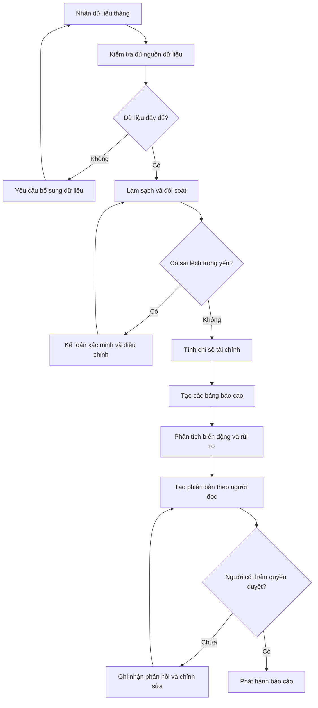
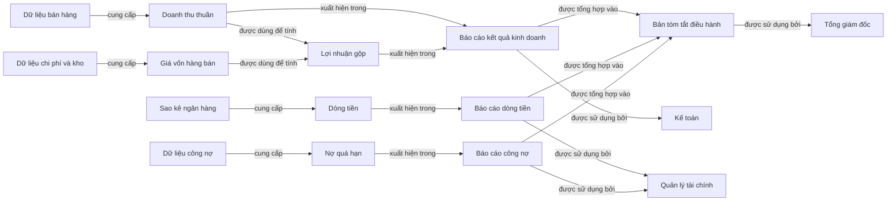

# Buổi 4 — Kiến trúc thông tin và cách biểu diễn  
> Biến bản đồ tri thức thành cấu trúc giúp người đọc hiểu nhanh, so sánh chính xác và đưa ra quyết định

---

## 0. Bạn đã có gì trước Buổi 4?

Từ Buổi 1–3, bạn (lý tưởng) đã có:

1. **Bản mô tả bài toán (Framing Brief)** cho một lĩnh vực thực tế.  
2. **Chuỗi câu lệnh V1 (Prompt Stack V1)** cho lĩnh vực đó.  
3. **Cây phân rã (Decomposition Tree)** gồm 3–4 tầng và ít nhất 20 thành phần.  
4. **Bản đồ quy trình hoặc bản đồ các bên liên quan**.

Buổi 4 sẽ dùng các sản phẩm đã tạo ở ba buổi trước để:

- chọn **dạng biểu diễn** phù hợp với mục đích sử dụng,
- dựng **Taxonomy**, **Hierarchy**, **Table/Matrix**, **Flowchart** và **Concept Map**,
- làm ra một **bộ kiến trúc thông tin** có thể dùng cho:
  - dạy học,  
  - thiết kế trợ lý AI,  
  - trình bày với các bên liên quan.

---

## 1. Mục tiêu Buổi 4

Sau buổi này, bạn có thể:

1. Phân biệt rõ:
  - **Taxonomy**, **Hierarchy**, **Ontology Thinking**, **Table**, **Matrix**, **Flowchart** và **Concept Map**.
2. Biết **khi nào dùng dạng nào**, theo mục tiêu:
   - học nhanh,
   - so sánh,
   - ra quyết định,
   - thiết kế khóa học.
3. Chuyển cây phân rã thành:
  - một **Taxonomy** theo tiêu chí rõ ràng,
  - một **Hierarchy** cho tài liệu, báo cáo hoặc khóa học,
  - một **Table hoặc Matrix** phục vụ quyết định cụ thể,
  - một **Flowchart** thể hiện các bước và điểm kiểm soát,
  - một **Concept Map** thể hiện mạng lưới quan hệ.
4. Tạo được **bộ kiến trúc thông tin** hoàn chỉnh cho lĩnh vực của bạn.

---

## 2. Vấn đề: cùng 1 nội dung, nhiều cách biểu diễn – không phải cách nào cũng tốt

### 2.1. Biểu diễn không phải chuyện… trang trí

Cùng 1 tập tri thức, bạn có thể:

- viết thành đoạn văn dài,
- danh sách gạch đầu dòng,
- cây phân cấp,
- bảng so sánh,
- ma trận hai chiều,
- sơ đồ quy trình,
- bản đồ khái niệm.

**Nhưng**:

- dạng trình bày **ảnh hưởng trực tiếp** đến:
  - tốc độ hiểu,
  - khả năng nhớ,
  - khả năng so sánh,
  - khả năng dạy lại.

### 2.2. Những vấn đề thường gặp ở người đã dùng AI từ 1–3 năm

- Dùng **danh sách gạch đầu dòng** cho mọi loại thông tin:
  - dù cần so sánh,
  - dù cần phân loại.
- Dùng **bảng** nhưng:
  - cột đặt tùy hứng,
  - không rõ tiêu chí,
  - người đọc không thấy “ra quyết định gì” từ đó.
- Nhầm lẫn:
  - Taxonomy và Hierarchy là một,
  - mọi cây phân cấp đều có thể dùng ngay làm mục lục.

---

## 3. Bảng khái niệm Buổi 4

| Khái niệm         | Mô tả ngắn                                                                                 |
|-------------------|--------------------------------------------------------------------------------------------|
| Taxonomy | Chia các đối tượng thành những nhóm theo một tiêu chí duy nhất và rõ ràng |
| Hierarchy | Sắp xếp nội dung theo quan hệ cha–con để tạo mục lục, chương hoặc cây thư mục |
| Ontology Thinking | Xác định các thực thể, thuộc tính, quan hệ và điều kiện phụ thuộc giữa chúng |
| Table Schema | Xác định trước các cột và ý nghĩa của từng cột, rồi mới yêu cầu AI điền nội dung |
| Matrix | Đặt hai chiều phân tích có ý nghĩa lên hàng và cột để xem các điểm giao nhau |
| Flowchart | Thể hiện thứ tự xử lý, điều kiện rẽ nhánh và các điểm cần kiểm tra hoặc phê duyệt |
| Concept Map | Nối các khái niệm bằng những quan hệ được gọi tên rõ ràng để người đọc hiểu toàn hệ thống |
| Mức độ phù hợp của dạng biểu diễn | Chọn đúng hình thức trình bày cho câu hỏi mà người đọc cần trả lời |

---

## 4. Hướng dẫn chọn dạng biểu diễn

| Mục tiêu chính                            | Dạng phù hợp nhất                 |
|-------------------------------------------|-----------------------------------|
| Muốn chia các đối tượng thành những nhóm rõ ràng | Taxonomy |
| Muốn thiết kế mục lục, chương trình học hoặc cấu trúc tài liệu | Hierarchy |
| Muốn biết một thực thể có thuộc tính gì và phụ thuộc vào thực thể nào | Ontology Thinking |
| Muốn so sánh nhiều đối tượng theo cùng một bộ tiêu chí | Table |
| Muốn xem điểm giao nhau giữa hai chiều phân tích | Matrix |
| Muốn mô tả thứ tự thực hiện và các điều kiện rẽ nhánh | Flowchart |
| Muốn thấy các khái niệm liên hệ với nhau theo những cách nào | Concept Map |

---

### 4.1. Ví dụ xuyên suốt: Báo cáo tài chính tháng

Để dễ thấy sự khác nhau giữa các dạng biểu diễn, bài này dùng lại lĩnh vực đã phân tích ở Buổi 3:
**tạo báo cáo tài chính tháng cho doanh nghiệp**.

Sau khi phân rã, ta đã biết lĩnh vực này có các thành phần chính:

- dữ liệu đầu vào: bán hàng, chi phí, công nợ, tồn kho;
- xử lý: kiểm tra, làm sạch, đối soát, tính toán;
- báo cáo: kết quả kinh doanh, dòng tiền, công nợ;
- phân tích: so sánh với kế hoạch, phát hiện bất thường và rút ra nhận định;
- người sử dụng: kế toán, quản lý tài chính, Tổng giám đốc và kiểm toán.

Buổi 3 giúp trả lời: **Lĩnh vực này gồm những gì và vận hành ra sao?**  
Buổi 4 giúp trả lời: **Nên sắp xếp và trình bày những gì đã biết theo dạng nào để người đọc hoặc AI sử dụng đúng mục đích?**

Ta sẽ biến cùng một cây phân rã thành năm loại kết quả khác nhau:

1. **Taxonomy** để chia dữ liệu và nội dung báo cáo thành các nhóm rõ ràng.
2. **Hierarchy** để tạo mục lục hoặc sắp xếp tài liệu theo mạch đọc.
3. **Table hoặc Matrix** để so sánh và chọn cách trình bày phù hợp với từng người dùng.
4. **Flowchart** để thể hiện thứ tự xử lý và các điểm cần kiểm tra.
5. **Concept Map** để nhìn thấy quan hệ giữa dữ liệu, chỉ số, báo cáo và người dùng.

### 4.2. Dữ liệu thực hành

Trong các kỹ thuật từ mục 5 đến mục 10, học viên sử dụng [`bai-04-sample-01.md`](bai-04-sample-01.md). Tệp này chứa dữ liệu giả lập về:

- kết quả kinh doanh;
- doanh thu theo sản phẩm và kênh;
- chi phí;
- dòng tiền;
- công nợ và tồn kho.

Quy trình thực hành cho mỗi kỹ thuật:

1. Đọc mục tiêu và câu lệnh mẫu.
2. Chỉnh câu lệnh nếu cần, nhưng giữ nguyên yêu cầu về kết quả cần tạo.
3. Gửi câu lệnh cho AI cùng nội dung của tệp dữ liệu mẫu 01.
4. Kiểm tra kết quả bằng danh sách câu hỏi ở cuối mỗi kỹ thuật.

---

## 5. Kỹ thuật 1 — Taxonomy

### 5.1. Cốt lõi

**Taxonomy** là cách chia một tập đối tượng thành các nhóm theo **một tiêu chí nhất quán**.

Với báo cáo tài chính tháng, cùng một tập dữ liệu có thể được phân loại:

- theo **nguồn dữ liệu**: bán hàng, ngân hàng, kho, kế toán;
- theo **mức độ nhạy cảm**: công khai nội bộ, hạn chế, mật;
- theo **vai trò trong báo cáo**: doanh thu, chi phí, tài sản, công nợ.

Mỗi tiêu chí phục vụ một quyết định khác nhau. Không trộn nhiều tiêu chí vào cùng một hệ phân loại.

### 5.2. Cách làm từng bước

**Bước 1 — Đặt câu hỏi phân loại**

Viết thành câu: “Tôi muốn phân loại **cái gì** theo **tiêu chí nào** để **làm gì**?”

Ví dụ:

> Tôi muốn phân loại dữ liệu đầu vào theo vai trò trong báo cáo để AI biết dữ liệu nào đi vào phần nào.

**Bước 2 — Liệt kê các đối tượng**

- hóa đơn bán hàng;
- phiếu chi và hóa đơn đầu vào;
- sao kê ngân hàng;
- dữ liệu tồn kho;
- danh sách phải thu, phải trả;
- bảng lương.

**Bước 3 — Tạo nhóm và gán đối tượng**

| Nhóm | Dữ liệu thuộc nhóm | Phần báo cáo sử dụng dữ liệu này |
|---|---|---|
| Doanh thu | Hóa đơn bán hàng, giảm giá, hàng hoàn | Doanh thu thuần, tăng trưởng doanh thu |
| Chi phí | Hóa đơn đầu vào, bảng lương, chi phí vận hành | Tổng chi phí, lợi nhuận |
| Tiền | Sao kê ngân hàng, phiếu thu, phiếu chi | Dòng tiền vào/ra, số dư tiền |
| Công nợ | Phải thu khách hàng, phải trả nhà cung cấp | Tuổi nợ, nợ quá hạn |
| Tồn kho | Nhập, xuất, tồn, giá vốn | Giá trị tồn kho, vòng quay kho |

### 5.3. Câu lệnh thực hành — Tạo Taxonomy

Nếu chỉ đưa một thư mục dữ liệu và yêu cầu “làm báo cáo”, AI dễ bỏ sót hoặc dùng sai dữ liệu. Hệ phân loại cung cấp **tên nhóm và quy tắc xác định dữ liệu thuộc phần nào của báo cáo**:

```text
Đọc tệp bai-04-sample-01.md.

Mục tiêu: tạo hệ phân loại để đưa từng nguồn dữ liệu vào đúng phần của báo cáo quản trị.

Hãy phân loại từng bảng và trường dữ liệu vào một trong các nhóm:
Doanh thu, Chi phí, Tiền, Công nợ, Tồn kho hoặc Kiểm soát dữ liệu.

Với mỗi nguồn, trả về:
- tên bảng hoặc trường dữ liệu;
- nhóm được chọn;
- lý do phân loại trong một câu;
- phần báo cáo sẽ sử dụng dữ liệu đó;
- trạng thái SẴN SÀNG hoặc CẦN LÀM RÕ.

Trình bày kết quả bằng bảng Markdown. Mỗi đối tượng chỉ có một nhóm chính.
Không tự thêm dữ liệu hoặc ép phân loại trường chưa rõ.
```

Kết quả trở nên dễ kiểm tra hơn vì mỗi nguồn dữ liệu đã có vị trí rõ ràng trước khi AI bắt đầu tính toán.

### 5.4. Câu hỏi kiểm tra nhanh

- Có thể gọi tên **một tiêu chí duy nhất** đang dùng không?
- Các nhóm có cùng cấp độ và ít chồng lấn không?
- Trường hợp chưa rõ nhóm có được đánh dấu thay vì ép phân loại không?
- Hệ phân loại có giúp xác định dữ liệu được dùng ở phần nào hoặc hỗ trợ một quyết định cụ thể không?

---

## 6. Kỹ thuật 2 — Hierarchy

### 6.1. Cốt lõi

**Hierarchy** sắp xếp nội dung theo nhiều tầng cha–con. Nó trả lời câu hỏi: “Nội dung này thuộc phần lớn nào và nên được đọc theo thứ tự nào?”

Cấu trúc phân cấp phù hợp để tạo:

- mục lục báo cáo;
- cấu trúc handbook;
- chương trình học hoặc tài liệu đào tạo;
- cây thư mục cho kho tri thức của trợ lý AI.

Hệ phân loại và cấu trúc phân cấp không giống nhau:

- Hệ phân loại gom đối tượng theo **một tiêu chí phân loại**.
- Cấu trúc phân cấp đặt nội dung vào **vị trí cha–con và thứ tự đọc**.

### 6.2. Từ cây phân rã đến mục lục báo cáo

Giả sử mục tiêu là tạo một báo cáo cho quản lý tài chính. Ta không bê nguyên cây phân rã sang, mà chọn và sắp xếp lại theo mạch đọc:

```markdown
I. Tóm tắt điều hành
  I.1. Kết quả nổi bật trong tháng
  I.2. Ba biến động cần chú ý
  I.3. Hành động đề xuất

II. Kết quả kinh doanh
  II.1. Doanh thu
    II.1.1. Theo sản phẩm
    II.1.2. Theo kênh bán
  II.2. Chi phí
  II.3. Lợi nhuận

III. Dòng tiền
  III.1. Dòng tiền vào
  III.2. Dòng tiền ra
  III.3. Số dư và dự báo ngắn hạn

IV. Công nợ và tồn kho
  IV.1. Phải thu và nợ quá hạn
  IV.2. Phải trả
  IV.3. Tồn kho chậm luân chuyển

V. Phụ lục kiểm soát
  V.1. Nguồn dữ liệu
  V.2. Giả định và công thức
  V.3. Các điểm chưa xác minh
```

Mạch đọc là: **kết luận trước → bằng chứng sau → chi tiết kiểm soát cuối cùng**. Báo cáo dành cho kế toán và báo cáo dành cho kiểm toán có thể dùng cùng dữ liệu nhưng cần cấu trúc phân cấp khác nhau.

### 6.3. Câu lệnh thực hành — Tạo Hierarchy

Cấu trúc phân cấp biến yêu cầu mơ hồ “viết báo cáo” thành một **bộ yêu cầu rõ ràng về bố cục**:

```text
Đọc tệp bai-04-sample-01.md.

Hãy thiết kế cấu trúc phân cấp 3 tầng cho báo cáo quản trị tháng dành cho Tổng giám đốc.
Chỉ tạo cấu trúc, chưa viết nội dung báo cáo.

Quy tắc:
- Có 5 mục cấp I: Tóm tắt điều hành, Kết quả kinh doanh,
  Dòng tiền, Rủi ro vận hành, Phụ lục kiểm soát.
- Mỗi mục cấp I có 2–4 mục cấp II.
- Chỉ chia cấp III khi thực sự cần.
- Sau mỗi mục cấp II, ghi trong ngoặc tên bảng nguồn từ tệp dữ liệu mẫu 01.
- Dữ liệu chưa xác minh phải có vị trí riêng trong Phụ lục kiểm soát.

Trình bày kết quả thành mục lục Markdown, đánh số theo dạng I, I.1, I.1.1.
Không thêm số liệu và không viết đoạn phân tích.
```

Nhờ vậy, các lần AI tạo báo cáo đều có cấu trúc ổn định, dễ rà soát và dễ chuyển sang Word, PDF hoặc bảng điều hành trực quan.
Lưu ý: Có thể điều chỉnh câu lệnh để tạo mục lục sách hoặc mục lục báo cáo tài chính, miễn là nêu rõ người đọc và mục đích sử dụng.

### 6.4. Câu hỏi kiểm tra nhanh

1. Các mục cùng cấp có thực sự đồng đẳng không?
2. Thứ tự có phù hợp với người đọc mục tiêu không?
3. Mỗi nội dung chỉ có một vị trí chính rõ ràng không?
4. Người đọc có thể dừng ở cấp 1 mà vẫn nắm được bức tranh lớn không?

---

## 7. Kỹ thuật 3 — Table và Matrix

### 7.1. Table — đặt các đối tượng cạnh nhau để ra quyết định

Bảng hữu ích khi cần so sánh nhiều đối tượng theo **cùng một bộ tiêu chí**. Cấu trúc hàng và cột phải xuất phát từ quyết định cần đưa ra, không phải từ những tiêu chí AI tình cờ nghĩ tới.

Ví dụ, mục tiêu là quyết định mỗi nhóm người dùng nên nhận phiên bản báo cáo nào:

| Người dùng | Câu hỏi chính | Mức chi tiết | Dạng báo cáo phù hợp | Rủi ro nếu thiết kế sai |
|---|---|---|---|---|
| Kế toán | Số liệu có đúng và đối soát được không? | Rất cao | Excel nhiều sheet + chứng từ nguồn | Không truy vết được sai lệch |
| Quản lý tài chính | Biến động nào cần xử lý? | Trung bình | Báo cáo 3–5 trang kèm các chỉ số quản trị chính | Bỏ lỡ vấn đề dòng tiền |
| Tổng giám đốc | Điều gì đã xảy ra và cần quyết định gì? | Thấp | Bản tóm tắt điều hành 1 trang | Quá tải chi tiết, chậm quyết định |
| Kiểm toán | Con số dựa trên bằng chứng nào? | Rất cao | Báo cáo kèm dấu vết kiểm tra | Không đủ bằng chứng xác minh |

Nhìn vào bảng, ta có thể quyết định format, độ dài và mức bằng chứng cho từng người đọc.

### 7.2. Thiết kế cấu trúc bảng trước khi nhờ AI điền nội dung

```text
Tôi cần thiết kế các phiên bản báo cáo tài chính tháng cho:
Kế toán, Quản lý tài chính, Tổng giám đốc và Kiểm toán.

Hãy đề xuất 2 phương án cấu trúc bảng so sánh. Với mỗi phương án:
- giải thích quyết định mà bảng hỗ trợ;
- nêu ưu và nhược điểm;
- không điền dữ liệu khi chưa thống nhất cấu trúc hàng và cột.

Sau đó chọn cấu trúc phù hợp nhất với mục tiêu:
"quyết định nội dung, độ chi tiết và định dạng báo cáo cho từng vai trò".
```

Tách bước **thiết kế cấu trúc bảng** khỏi bước **điền nội dung** giúp ta kiểm soát logic trước khi AI tạo ra một bảng dài nhưng không hỗ trợ quyết định nào.

### 7.3. Matrix — xem điểm giao nhau giữa hai chiều phân tích

Ma trận phù hợp khi cả hàng và cột đều là những chiều phân tích có ý nghĩa. Ví dụ: **nhóm nội dung × nhóm người dùng**.

| Nội dung \ Người dùng | Kế toán | Quản lý tài chính | Tổng giám đốc | Kiểm toán |
|---|---|---|---|---|
| Số liệu chi tiết | Đầy đủ | Các chỉ số quản trị chính | Chỉ số tổng hợp | Đầy đủ |
| So sánh tháng trước/kế hoạch | Có | Có | Có | Khi cần |
| Nhận định và cảnh báo | Lỗi đối soát | Rủi ro vận hành | Tác động kinh doanh | Sai lệch trọng yếu |
| Chứng từ và công thức | Liên kết trực tiếp | Theo yêu cầu | Không hiển thị | Bắt buộc |
| Hành động đề xuất | Sửa dữ liệu | Phương án xử lý | Quyết định ưu tiên | Yêu cầu xác minh |

Ma trận làm rõ hai điều mà một danh sách thông thường khó cho thấy:

- nội dung nào dùng chung cho mọi vai trò;
- nội dung nào phải thay đổi theo người đọc.

Đây chính là cơ sở để xây **quy tắc rẽ nhánh**, giúp trợ lý AI tạo nội dung phù hợp với từng nhóm người đọc.

### 7.4. Table và Matrix cải thiện kết quả của AI ra sao?

- Ép AI dùng cùng tiêu chí cho mọi đối tượng.
- Làm lộ ô thiếu, sự bất nhất và so sánh lệch cấp độ.
- Cho phép chuyển trực tiếp kết quả phân tích thành quy tắc tạo báo cáo.
- Giảm tình trạng mỗi lần chạy AI lại trả về một cấu trúc khác.

### 7.5. Câu lệnh thực hành — Tạo Table và Matrix

```text
Đọc tệp bai-04-sample-01.md và tạo hai kết quả ở định dạng Markdown:

KẾT QUẢ 1 — Bảng so sánh
So sánh Tháng 6 với Tháng 5 và Kế hoạch tháng 6 cho các chỉ tiêu:
Doanh thu thuần, Lợi nhuận gộp, Chi phí vận hành,
Lợi nhuận trước thuế và Dòng tiền thuần.

Các cột bắt buộc:
Chỉ tiêu | Tháng 5 | Tháng 6 | Kế hoạch tháng 6 |
Chênh lệch so với tháng 5 | Chênh lệch so với kế hoạch | Tín hiệu quản trị.

KẾT QUẢ 2 — Ma trận
Hàng: Kết quả kinh doanh, Dòng tiền, Công nợ, Tồn kho, Kiểm soát dữ liệu.
Cột: Kế toán, Quản lý tài chính, Tổng giám đốc, Kiểm toán.
Mỗi ô ghi nội dung mà vai trò đó cần xem, tối đa 12 từ.

Chỉ dùng dữ liệu trong tệp dữ liệu mẫu 01. Kiểm tra lại phép tính trước khi trả lời.
Nếu không đủ dữ liệu cho một ô, ghi "Chưa đủ dữ liệu".
```

---

## 8. Kỹ thuật 4 — Ontology Thinking

**Ontology Thinking** không chỉ hỏi “xếp vào nhóm nào?” mà còn yêu cầu trả lời:

- Có những **thực thể** nào?
- Mỗi thực thể có **thuộc tính** gì?
- Chúng có **quan hệ và phụ thuộc** ra sao?

Ví dụ đơn giản:

```markdown
Thực thể: Chỉ số "Lợi nhuận gộp"
- Thuộc tính: giá trị, kỳ báo cáo, đơn vị tiền, nguồn dữ liệu.
- Phụ thuộc vào: Doanh thu thuần, Giá vốn hàng bán.
- Được so sánh với: Kế hoạch tháng, Kết quả tháng trước.
- Xuất hiện trong: Báo cáo kết quả kinh doanh, Bản tóm tắt điều hành.
- Được sử dụng bởi: Quản lý tài chính, Tổng giám đốc.
```

Từ quan hệ này, ta biết AI chỉ được tính lợi nhuận gộp sau khi doanh thu và giá vốn đã được xác minh. Ta cũng biết chỉ số phải xuất hiện ở đâu và phục vụ ai.

### 8.1. Câu lệnh thực hành — Áp dụng Ontology Thinking

```text
Đọc tệp bai-04-sample-01.md.

Hãy mô hình hóa 8–12 thực thể quan trọng. Với mỗi thực thể, hãy nêu rõ:
- tên thực thể;
- các thuộc tính quan trọng;
- dữ liệu hoặc thực thể mà nó phụ thuộc vào;
- kết quả mà nó góp phần tạo nên;
- báo cáo mà nó xuất hiện;
- người sử dụng nó.

Bắt buộc có các thực thể: Doanh thu thuần, Giá vốn hàng bán,
Lợi nhuận gộp, Dòng tiền thuần, Công nợ quá hạn và Tồn kho.

Sau danh sách thực thể, tạo bảng kiểm tra điều kiện phụ thuộc gồm:
Chỉ số | Dữ liệu bắt buộc phải có | Trạng thái SẴN SÀNG/CHƯA THỂ XỬ LÝ | Lý do.

Chỉ dùng những quan hệ có thể truy vết từ tệp dữ liệu mẫu 01.
Không ước lượng thay cho dữ liệu thiếu.
```

Tư duy bản thể vì vậy hữu ích khi thiết kế thứ tự xử lý, quy tắc kiểm tra dữ liệu và chuỗi điều kiện phụ thuộc cho trợ lý AI.

---

## 9. Kỹ thuật 5 — Flowchart

### 9.1. Khi nào dùng?

Dùng **Flowchart** khi câu hỏi liên quan đến: **bước nào diễn ra trước, điều kiện nào dẫn đến bước tiếp theo, khi nào phải quay lại và khi nào quy trình kết thúc**.

Sơ đồ quy trình không nhằm liệt kê lĩnh vực gồm những gì. Nó chỉ ra:

- bước nào diễn ra trước;
- kết quả của bước trước trở thành dữ liệu đầu vào cho bước nào;
- điều kiện nào làm quy trình tiếp tục, quay lại hoặc dừng;
- chỗ nào cần con người phê duyệt.

### 9.2. Quy trình tạo báo cáo tài chính tháng



Giá trị chính của sơ đồ không nằm ở hình thức đẹp, mà ở ba điểm kiểm soát:

1. Không xử lý khi dữ liệu chưa đủ.
2. Không tính toán khi sai lệch chưa được xác minh.
3. Không phát hành khi chưa được phê duyệt.

### 9.3. Câu lệnh thực hành — Tạo Flowchart

Sơ đồ này có thể chuyển thành quy trình làm việc cho trợ lý AI: mỗi ô biểu diễn một bước, mỗi nhánh biểu diễn một hướng xử lý, còn mỗi điểm rẽ nhánh biểu diễn một điều kiện cần kiểm tra.

```text
Đọc tệp bai-04-sample-01.md, đặc biệt phần "Các điểm cần xác minh".

Hãy dùng Mermaid để tạo sơ đồ quy trình lập báo cáo quản trị tháng,
từ nhận dữ liệu đến phát hành báo cáo.

Yêu cầu:
- có từ 8–14 bước hành động;
- có ít nhất 3 điểm rẽ nhánh theo điều kiện;
- có nhánh khi dữ liệu thiếu;
- có nhánh khi số liệu đối soát sai;
- có bước kế toán xác minh;
- có bước người có thẩm quyền phê duyệt;
- không cho phép AI tự phê duyệt.

Sau sơ đồ, lập bảng:
Điểm cần quyết định | Khi điều kiện được đáp ứng | Khi điều kiện không được đáp ứng | Người chịu trách nhiệm.
```

### 9.4. Câu hỏi kiểm tra nhanh

- Mỗi ô có diễn đạt một hành động hoặc một câu hỏi quyết định rõ ràng không?
- Mỗi nhánh quyết định có nhãn điều kiện không?
- Có đường xử lý khi dữ liệu lỗi hoặc thiếu không?
- Điểm bắt đầu, kết thúc và phê duyệt có rõ không?

---

## 10. Kỹ thuật 6 — Concept Map

### 10.1. Khi nào dùng?

Dùng **Concept Map** khi cần hiểu **khái niệm nào liên quan đến khái niệm nào, và bản chất của từng mối liên hệ là gì**.

Khác với sơ đồ quy trình:

- Sơ đồ quy trình nhấn mạnh **thứ tự hành động và điều kiện chuyển bước**.
- Bản đồ khái niệm nhấn mạnh **ý nghĩa của các mối quan hệ**, không bắt buộc phải có thứ tự trước–sau.

Mỗi đường nối phải diễn đạt thành một quan hệ đủ nghĩa, chẳng hạn: `dữ liệu này được dùng để tính chỉ số`, `chỉ số này xuất hiện trong báo cáo`, hoặc `báo cáo này được người quản lý sử dụng để ra quyết định`. Nếu người đọc không thể đặt hai đầu mũi tên thành một câu hoàn chỉnh, nhãn quan hệ vẫn chưa đủ rõ.

### 10.2. Concept Map cho báo cáo tài chính tháng



Bản đồ khái niệm này giúp người đọc nhận ra:

- một chỉ số phụ thuộc vào nguồn dữ liệu nào;
- một nguồn dữ liệu ảnh hưởng đến báo cáo nào;
- mỗi báo cáo phục vụ người dùng nào;
- khi một nguồn dữ liệu hoặc chỉ số thay đổi, những báo cáo và người dùng nào có thể bị ảnh hưởng.

### 10.3. Câu lệnh thực hành — Tạo Concept Map

Bản đồ khái niệm cung cấp bối cảnh có cấu trúc cho AI. Nó đặc biệt hữu ích khi AI cần tìm thông tin trong kho tri thức hoặc giải thích một kết luận được hình thành từ những dữ liệu nào.

```text
Đọc tệp bai-04-sample-01.md.

Hãy dùng Mermaid để tạo bản đồ khái niệm nối bốn nhóm thành phần:
Nguồn dữ liệu → Chỉ số → Rủi ro hoặc nhận định → Người sử dụng.

Yêu cầu:
- có từ 12–20 khái niệm hoặc thực thể;
- ít nhất 4 loại quan hệ có nhãn;
- có đường truy vết từ dữ liệu bán hàng đến Tổng giám đốc;
- có đường truy vết từ sao kê ngân hàng đến rủi ro dòng tiền;
- thể hiện các điểm cần xác minh nhưng không suy đoán nguyên nhân;
- không biến bản đồ khái niệm thành một chuỗi bước thực hiện tuần tự.

Sau sơ đồ, giải thích hai đường truy vết quan trọng, mỗi đường tối đa 80 từ.
Không tạo quan hệ không có bằng chứng trong tệp dữ liệu mẫu 01.
```

### 10.4. Câu hỏi kiểm tra nhanh

- Mỗi ô có biểu diễn một khái niệm hoặc thực thể rõ ràng không?
- Mỗi đường nối có tên quan hệ không?
- Bản đồ có thể hiện nhiều loại quan hệ, thay vì chỉ mô tả thứ tự như một sơ đồ quy trình không?
- Có thể truy vết từ dữ liệu đến chỉ số, báo cáo và người dùng không?

---

## 11. Bài tập Buổi 4

Tất cả bài tập sử dụng [`bai-04-sample-01.md`](bai-04-sample-01.md). Mỗi bài phải nộp đủ ba phần:

1. **Câu lệnh do học viên tự viết**, không sao chép nguyên câu lệnh mẫu.
2. **Kết quả do AI tạo ra** từ câu lệnh đó.
3. **Phần tự đánh giá gồm 3–5 ý**: kết quả đã đáp ứng yêu cầu nào, còn sai hoặc thiếu ở đâu, và cần sửa câu lệnh như thế nào.

### 11.1. Bài tập 1 — Viết câu lệnh tạo Taxonomy

Viết một câu lệnh yêu cầu AI phân loại toàn bộ các bảng trong dữ liệu mẫu 01 theo **một tiêu chí duy nhất**, qua đó xác định mỗi bảng sẽ được sử dụng ở phần nào của báo cáo.

**Kết quả bắt buộc phải có:**

- hệ phân loại được trình bày bằng bảng Markdown;
- 4–6 nhóm đồng đẳng;
- mỗi bảng dữ liệu có một nhóm chính;
- có các cột `Lý do phân loại`, `Phần báo cáo sử dụng` và `Trạng thái dữ liệu`;
- các trường hợp mơ hồ được đánh dấu, không bị ép nhóm.

**Câu hỏi tự kiểm tra:** Sau khi đọc câu lệnh, AI có biết rõ cần phân loại *đối tượng nào*, *theo tiêu chí nào* và *kết quả phân loại sẽ phục vụ quyết định gì* không?

### 11.2. Bài tập 2 — Viết câu lệnh tạo Hierarchy

Chọn một người đọc là **Tổng giám đốc** hoặc **kế toán**. Viết câu lệnh yêu cầu AI tạo mục lục báo cáo tài chính gồm 3 tầng từ dữ liệu mẫu 01.

**Kết quả bắt buộc phải có:**

- 4–6 mục cấp I;
- ít nhất hai mục cấp II trong mỗi mục cấp I;
- ghi nguồn dữ liệu bên cạnh từng mục;
- thứ tự phù hợp với người đọc đã chọn;
- chưa viết nội dung báo cáo.

**Câu hỏi tự kiểm tra:** Nếu đổi người đọc từ Tổng giám đốc sang kế toán, cấu trúc và thứ tự các phần của báo cáo phải thay đổi như thế nào?

### 11.3. Bài tập 3 — Viết câu lệnh tạo bảng hỗ trợ quyết định

Viết một câu lệnh yêu cầu AI tạo **bảng so sánh hoặc ma trận** từ dữ liệu mẫu 01. Bảng phải giúp người đọc đưa ra một quyết định quản trị cụ thể.

Trước khi viết câu lệnh, hãy hoàn thành câu:

> Nhìn vào bảng này, tôi muốn quyết định __________.

**Kết quả bắt buộc phải có:**

- ý nghĩa của từng hàng và từng cột được quy định ngay trong câu lệnh;
- có ít nhất một phép so sánh với tháng trước hoặc kế hoạch;
- có cột/ô chuyển số liệu thành tín hiệu quản trị;
- dữ liệu thiếu ghi `Chưa đủ dữ liệu`;
- mọi phép tính có thể truy ngược về tệp dữ liệu mẫu 01.

**Câu hỏi tự kiểm tra:** Sau khi đọc bảng, người dùng có thể đưa ra quyết định cụ thể nào mà trước đó họ chưa đủ thông tin để quyết định?

### 11.4. Bài tập 4 — Viết câu lệnh tạo Flowchart và Concept Map

Viết **một câu lệnh** yêu cầu AI dùng Mermaid để tạo hai sơ đồ từ dữ liệu mẫu 01:

1. Sơ đồ quy trình lập, kiểm tra và phê duyệt báo cáo.
2. Bản đồ khái niệm nối nguồn dữ liệu, chỉ số, rủi ro và người sử dụng.

**Kết quả bắt buộc phải có:**

- sơ đồ quy trình có ít nhất hai điểm rẽ nhánh theo điều kiện và một nhánh quay lại bước trước;
- bản đồ khái niệm có từ 10–16 khái niệm hoặc thực thể, đồng thời sử dụng ít nhất ba loại quan hệ được gọi tên rõ ràng;
- hai sơ đồ không trùng chức năng;
- có hai ý giải thích sự khác nhau giữa sơ đồ quy trình và bản đồ khái niệm;
- không thêm quan hệ hoặc bước không có căn cứ mà không gắn nhãn `Giả định`.

**Câu hỏi tự kiểm tra:** Sơ đồ thứ nhất có cho biết bước tiếp theo phải làm gì và trong điều kiện nào không? Sơ đồ thứ hai có cho biết các khái niệm liên hệ với nhau theo cách nào không?

---

## 12. Bài tập cuối Buổi 4 — Hoàn thiện báo cáo kết quả học tập

### 12.1. Bối cảnh và dữ liệu

Ban giám hiệu Trường THCS Hòa Bình cần một báo cáo cuối năm ngắn gọn nhưng có thể truy vết. Học viên phải dùng duy nhất [`bai-04-sample-02.md`](bai-04-sample-02.md) làm nguồn dữ liệu.

Không bổ sung số liệu từ Internet và không suy đoán thông tin cá nhân, giới tính, hoàn cảnh kinh tế hoặc nguyên nhân chưa có bằng chứng.

### 12.2. Nhiệm vụ

Viết một **câu lệnh tổng hợp** yêu cầu AI đọc dữ liệu mẫu 02 và tạo **một báo cáo Markdown hoàn chỉnh** dành cho Ban giám hiệu.

Báo cáo phải gồm đúng các phần:

1. **Tóm tắt điều hành:** 5–8 ý nêu kết quả, mức tiến bộ, rủi ro và nội dung cần ưu tiên.
2. **Các yếu tố liên quan:** phân loại các yếu tố và phân tích theo từng môn; chỉ được nói “có liên hệ”, không được khẳng định quan hệ nhân quả.
3. **Bản đồ khái niệm theo thời gian:** dùng Mermaid để nối các mốc thời gian, biện pháp can thiệp, hành vi học tập và kết quả quan sát.
4. **Sơ đồ quy trình kiểm tra, đánh giá:** dùng Mermaid để thể hiện các bước rà soát, phê duyệt, kiểm tra dữ liệu và xử lý trường hợp bất thường.
5. **Bảng tổng kết thành tích:** điểm toàn trường, phân bố thành tích, môn/lớp nổi bật và nhóm cần hỗ trợ.
6. **Khuyến nghị hành động:** 3–5 đề xuất gắn trực tiếp với dữ liệu.
7. **Hạn chế dữ liệu:** nêu rõ điều gì chưa thể kết luận.

### 12.3. Sản phẩm cần nộp

Nộp hai thành phần:

1. Câu lệnh tổng hợp đã sử dụng.
2. Tệp báo cáo hoàn chỉnh có tên `report.md`.

Tệp [`report.md`](report.md) trong thư mục bài học là **đáp án tham khảo**. Chỉ mở sau khi đã tạo phiên bản đầu tiên để so sánh cấu trúc, độ chính xác và cách kiểm soát suy luận.

### 12.4. Tiêu chí bắt buộc

- Mọi con số phải khớp với tệp dữ liệu mẫu 02 và có thể truy vết về bảng nguồn.
- Không cộng số học sinh dưới 5,0 của các môn để suy ra số học sinh duy nhất.
- Không biến chênh lệch quan sát thành kết luận nhân quả.
- Bản đồ khái niệm phải gọi tên rõ từng mối quan hệ; sơ đồ quy trình phải có điểm rẽ nhánh theo điều kiện.
- Báo cáo ưu tiên khả năng ra quyết định, không chép lại toàn bộ dữ liệu.
- Nếu dữ liệu không đủ, ghi rõ `Chưa đủ dữ liệu`.

### 12.5. Bảng tiêu chí tự chấm

| Tiêu chí | Mô tả | Điểm (0–5) |
|---|---|---:|
| Mức độ rõ ràng của câu lệnh | Nêu rõ vai trò của AI, nhiệm vụ, nguồn dữ liệu, giới hạn và cấu trúc báo cáo cần tạo | /5 |
| Độ chính xác của thông tin | Số liệu và phép so sánh khớp với dữ liệu mẫu 02 | /5 |
| Cấu trúc thông tin | Báo cáo có mạch rõ ràng từ kết luận đến bằng chứng và hành động | /5 |
| Phân tích các yếu tố | Phân nhóm rõ, phân tích đủ các môn và không nhầm mối liên hệ với quan hệ nhân quả | /5 |
| Bản đồ khái niệm | Thời gian, biện pháp can thiệp, hành vi và kết quả được nối bằng những quan hệ có ý nghĩa | /5 |
| Quy trình đánh giá | Các bước, điểm rẽ nhánh, nhánh sửa lỗi và người phê duyệt được thể hiện rõ | /5 |
| Bảng tổng kết | Chọn đúng các chỉ số giúp Ban giám hiệu đưa ra quyết định | /5 |
| Kiểm soát độ tin cậy | Nêu rõ dữ liệu còn thiếu, giới hạn phân tích và không tự tạo thông tin không có trong nguồn | /5 |
| **Tổng** |  | **/40** |

---

## 13. Sau Buổi 4 – Bạn đã có gì?

Nếu bạn hoàn thành Buổi 4:

- Bạn không chỉ có “cây tri thức” (Buổi 3),
- Mà còn có:

  - **Taxonomy**: chia thông tin thành các nhóm theo một tiêu chí phù hợp,
  - **Hierarchy**: tạo sườn cho báo cáo, sổ tay hoặc khóa học,
  - **Table và Matrix**: giúp so sánh thông tin và đưa ra quyết định,
  - **Flowchart**: thể hiện thứ tự công việc cùng các điểm kiểm tra và phê duyệt,
  - **Concept Map**: thể hiện mạng lưới quan hệ giữa dữ liệu, chỉ số, báo cáo và người dùng,
  - **Một báo cáo hoàn chỉnh**: kết hợp nhiều dạng biểu diễn trong cùng một sản phẩm để phục vụ việc ra quyết định.

Như vậy, lĩnh vực bạn đang nghiên cứu:

- đã có **bản đồ** (Buổi 3),
- **có cách trình bày có chủ đích**,
- và bạn biết viết câu lệnh để chuyển dữ liệu thô thành kết quả có cấu trúc, có thể kiểm tra.

Buổi 5 sẽ mở rộng **chiều rộng & chiều sâu nghiên cứu**:

- quét rộng (breadth-first),
- mở rộng từ khóa,
- khám phá chủ đề theo nhiều khía cạnh,
- chọn những phần cần đào sâu,
- thiết kế lộ trình nghiên cứu.

---
